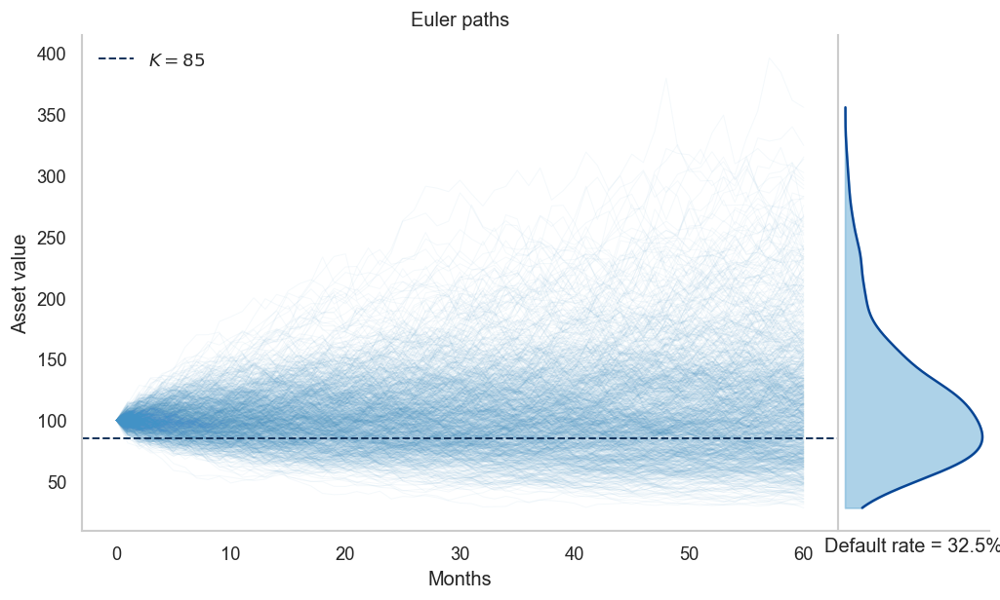
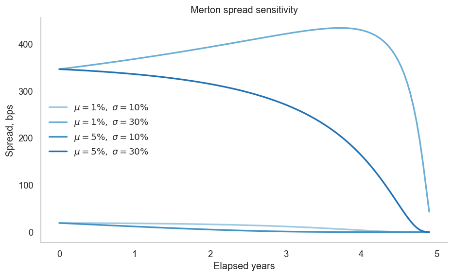
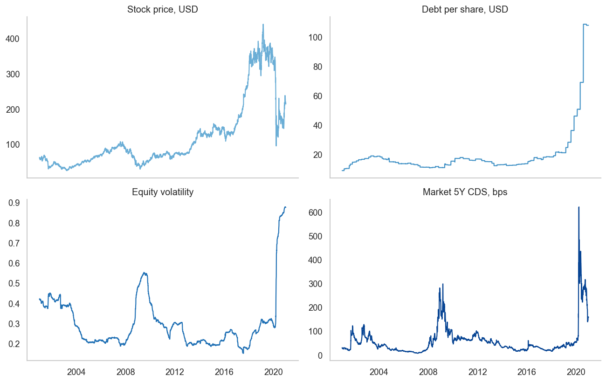
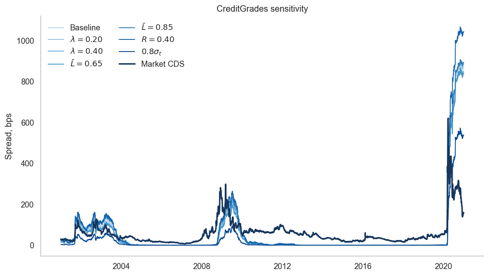
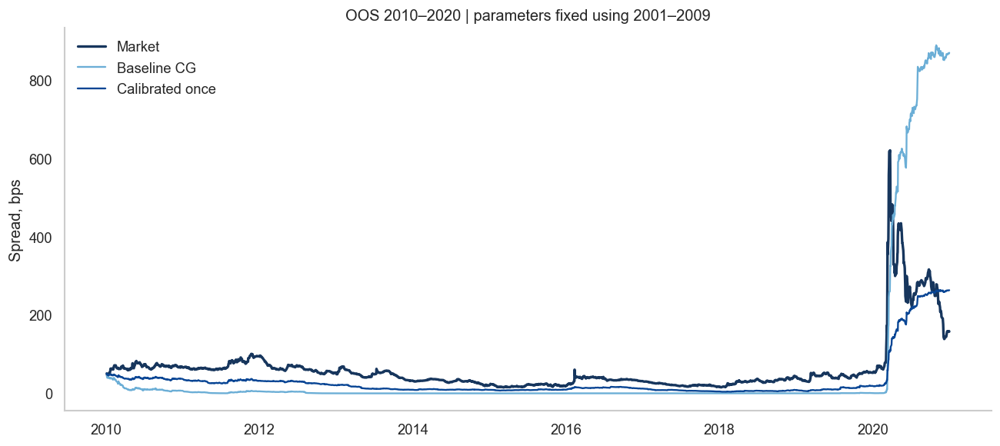

# Credit Risk Estimation with Structural Models

Suppose we want to estimate the credit risk of a company. Such an estimate can be useful for CDS pricing, early detection of deterioration in the borrower’s financial condition, and refinement of credit ratings.

One way to estimate credit risk from market information is to use structural credit risk models, such as the Merton model and its extensions, including [CreditGrades](https://www.msci.com/documents/10199/dd31bcce-6fe3-47b7-9fb7-10c4c8f750ba).

In both models, the value of the company’s assets is assumed to follow a geometric Brownian motion. Under the physical probability measure, it can be written as

  

This means that log returns are normally distributed. Therefore, if we estimate the parameters `mu` and `sigma_V` sufficiently well, we can describe the physical distribution of future asset values.

One simple way to see this is to simulate many possible paths of the asset value and then look at the distribution of terminal values. In Figure 1, I set the initial asset value to 100 and the default barrier to 85. By simulating many paths, we obtain the distribution of the asset value at the end of the horizon and can estimate the physical probability that the asset value falls below the default barrier.

However, this approach has several strong limitations.

First, the dynamics of the company may experience structural breaks. In this case, parameters estimated from historical data may no longer describe the current process well. One possible extension is to introduce jumps into the dynamics.

Second, the parameters themselves may change over time and depend on the current state of the company or the market. Instead of assuming constant parameters, one can write

  

where `X_t` is a set of observable features. For example, `f_mu` and `f_sigma` can be estimated using boosting or a neural network trained to predict drift and volatility from current information.

For pricing credit instruments, however, structural models are usually considered under the risk-neutral measure. In this case, the asset dynamics can be written as

  

where `r_t` is the risk-free rate and `delta_t` represents payouts from the firm. Thus, the physical drift `mu` is relevant for forecasting physical default probabilities, but does not directly enter the risk-neutral pricing formulas used below.

In the Merton model, the basic idea is very simple. Let `V_T` be the value of the company’s assets at the debt maturity date and `D` be the amount of debt that must be repaid. Default occurs when

  

while the equity value at maturity is

  

Economically, this is natural. If the company owns assets worth more than its debt, it can repay creditors and the remaining value belongs to shareholders. If the value of the assets is below the amount of debt, the company cannot fully repay its obligations. Shareholders have limited liability, so their payoff is zero, while creditors bear the loss.

Therefore, equity can be interpreted as a call option on the company’s assets with strike equal to the debt level.

Figure 2 illustrates the sensitivity of the Merton-implied credit spread to asset volatility and to different hypothetical paths of the firm’s asset value. The drift parameter `mu` is used only to generate these illustrative asset-value paths; it does not directly enter the risk-neutral Merton pricing formula.

In my case, however, I do not focus on improving the Merton model itself. My goal was to test whether the CreditGrades approach works reasonably well in practice.

An important extension of CreditGrades relative to the basic Merton framework is that the default barrier is itself uncertain rather than fixed. Thus, the model introduces an additional source of uncertainty into the default mechanism.

For the empirical example, I use Boeing. It seems to be a useful case because the company experienced periods of significant credit deterioration, while at the same time being large enough for both its stock and CDS contracts to have relatively liquid market prices.

Structural models are generally sensitive to their parameters. Therefore, an important practical question is how these parameters should be estimated.

In CreditGrades, the CDS spread can be written as a function of observable market variables and several structural parameters:

  

where `S_t` is the stock price, `D_t` is debt per share, `r_t` is the risk-free rate, and `sigma_{S,t}` is equity volatility. The parameters `lambda` and `L` control uncertainty in the default barrier and its average level.

The figure below shows that CreditGrades estimates can change substantially when these assumptions are changed. I vary `lambda`, `L`, recovery rate `R`, and the level of equity volatility.

This sensitivity means that parameter estimation is an important part of the model.

More advanced approaches could allow structural parameters to change over time or depend on observable information. Another possibility is to recalibrate the model sequentially using a walk-forward procedure. Here I use a simpler experiment. I split the sample into

  

and estimate the CreditGrades parameters only once on the training sample.

I keep the recovery rate and CDS maturity fixed at

  

and calibrate `lambda` and `L` by minimizing the squared error between log model spreads and log market CDS spreads:

  

The baseline CreditGrades parameters are

  

while calibration on 2001–2009 gives approximately

  

These parameters are then fixed for the entire 2010–2020 test period. Thus, the test does not use future CDS information to update the CreditGrades parameters.

The out-of-sample comparison is shown below.

The calibrated model follows the market CDS spread considerably more closely than the baseline specification:

| Metric | Baseline CG | Calibrated once |
| --- | ---: | ---: |
| RMSE, bps | 141.879 | 50.593 |
| MAE, bps | 72.765 | 32.788 |
| Bias, bps | -7.831 | -30.536 |

I also test whether the model can be useful for a simple CDS-equity hedge.

On the training sample, I estimate the relation between changes in the model CDS spread and changes in the stock price:

  

The estimated `beta` is then fixed during the test period. Since the estimated relation is negative, an increase in the stock price is associated with a decrease in credit spreads.

The CDS position is converted into an equity hedge using the CDS risky annuity:

  

The resulting out-of-sample hedge performance is:

| Metric | Baseline CG | Calibrated once |
| --- | ---: | ---: |
| Unhedged annual vol / notional | 0.0394 | 0.0394 |
| Hedged annual vol / notional | 0.0380 | 0.0355 |
| Variance reduction | 0.0704 | 0.1861 |

Therefore, even a simple one-time calibration substantially improves the out-of-sample fit of CreditGrades to observed CDS spreads. It also improves the effectiveness of the CDS-equity hedge: variance reduction increases from about 7% for the baseline model to about 19% for the calibrated model.

At the same time, the experiment shows an important limitation of structural models: their practical performance can depend strongly on structural parameter assumptions. This makes parameter estimation and parameter stability important questions for further improvement.
