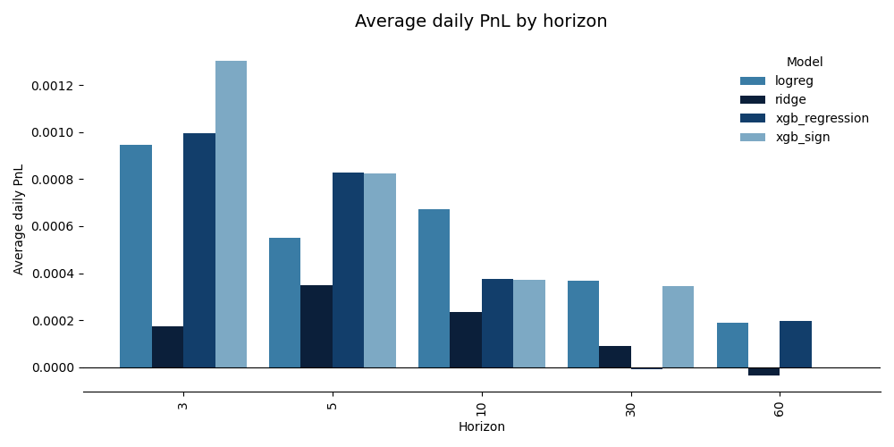
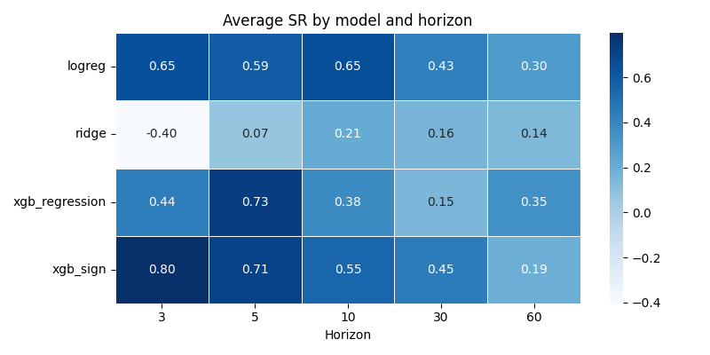
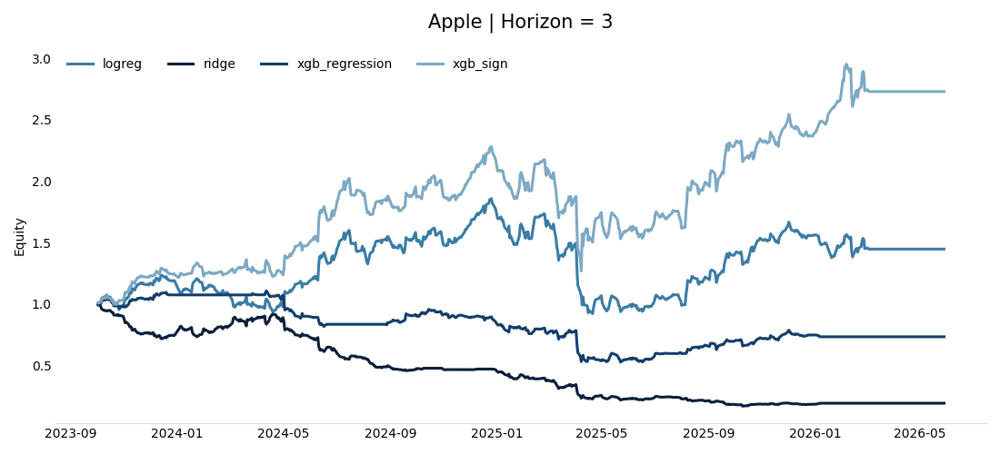

# Return Forecasting vs Return Classification

In this experiment, I investigate a simple question: what is more useful in practice, forecasting future returns directly or forecasting the class to which the future return belongs?

## Data

The data was downloaded from Yahoo Finance. More details can be found in `parser.ipynb`.

Assets:

- TSLA
- AAPL
- QQQ
- BTC

Frequency: daily.

Sample period:

- 2014-09-17
- 2026-05-29

Forecast horizons were 3, 5, 10, 30, and 60 trading days. The prediction target is the future log return over the corresponding forecast horizon.

Features were generated from OHLCV data. More details can be found in `feature_generation.ipynb`.

The feature set was intentionally kept simple. The objective of this experiment was not to build the strongest possible predictive model, but rather to compare two different problem formulations under a clean and controlled setup.

All experiments were conducted using a walk-forward framework with 1260 trading days for training, 252 trading days for validation, and 21 trading days for testing.

All preprocessing steps were fitted exclusively on the training sample and subsequently applied to the validation and test periods, preventing look-ahead bias.

Transaction costs were assumed to be

<p align="center">
  
</p>

for each executed trade.

## Experimental Setup

All experiments were conducted using a walk-forward framework.

For every forecast horizon, an embargo period equal to

<p align="center">
  
</p>

was applied.

Since multi-period returns overlap, all statistical hypothesis tests were performed using HAC (Heteroskedasticity and Autocorrelation Consistent) standard errors.

For PnL calculations, realized returns were scaled by

<p align="center">
  
</p>

to make results comparable across horizons.

## Does Return Forecasting Make Sense?

Under the weak-form Efficient Market Hypothesis, asset prices behave approximately as a random walk. Therefore,

<p align="center">
  
</p>

where F_t denotes the information set available at time t.

If this statement is approximately true, then minimizing MSE may not be a meaningful objective because the conditional mean of future returns is already close to zero.

To investigate this question, I first estimated the following regression:

<p align="center">
  
</p>

where \( X_t \) contains all predictors later used in the machine learning models.

The corresponding hypothesis test is

<p align="center">
  
</p>

against

<p align="center">
  
</p>

In this setup, the null hypothesis is rejected almost always at the 5% significance level.

However, this result only establishes the existence of in-sample predictive relationships.

A more relevant question is whether these predictors generate statistically significant out-of-sample forecasting improvements.

To answer this question, I use the Clark-West test. Clark-West statistics were computed using the sequence of out-of-sample forecasts generated by the walk-forward procedure.

The benchmark forecast is the historical mean estimated on the training sample:

<p align="center">
  
</p>

The competing forecast is generated by the linear model:

<p align="center">
  
</p>

The benchmark and model forecast errors are

<p align="center">
  
</p>

and

<p align="center">
  
</p>

The Clark-West adjusted loss differential is

<p align="center">
  
</p>

The following regression is then estimated:

<p align="center">
  
</p>

using HAC standard errors.

The hypotheses become

<p align="center">
  
</p>

and

<p align="center">
  0" />
</p>

Rejecting the null implies that the forecasting model provides statistically significant out-of-sample improvements relative to the benchmark.

In contrast to the previous regression test, the Clark-West test generally fails to reject the null hypothesis. More details can be found in `H_test.ipynb`.

This result suggests that, given the relatively simple feature set used here, direct return forecasting has limited practical value.

## Return Classification

Because return forecasting produced weak out-of-sample results, I also considered a classification formulation.

Instead of predicting the exact future return, the model predicts a return class.

Transaction costs are incorporated directly into the target definition.

```text
{
    1   if return is bigger than c
    0   if return is between -c and c
   -1   if return is smaller than -c
}
```

The corresponding trading positions are long (+1), flat (0), and short (-1).

This formulation embeds transaction costs directly into the prediction target. As a result, the model focuses only on economically meaningful price movements. Small returns that cannot overcome trading costs are automatically classified as neutral observations.

Additional noise filtering can also be incorporated naturally through the target definition itself.
More details can be found in:

- `XGB_sign.ipynb`
- `logreg (1).ipynb`

## Regression Models

For the regression models, the objective function is standard MSE:

<p align="center">
  
</p>

Since regression models output return forecasts rather than trading decisions, optimal entry and exit thresholds must be selected separately.

To ensure a fair comparison, thresholds were chosen according to

<p align="center">
  
</p>

Threshold optimization was performed exclusively on the training sample within each walk-forward iteration, and the resulting threshold was then applied unchanged to the corresponding out-of-sample test period.

Transaction costs were included during threshold optimization, ensuring that both regression and classification formulations were evaluated under the same economic assumptions.

In other words, all regression models use economically optimal thresholds obtained by directly maximizing realized trading performance.

## Results

More details can be found in `econ_metrics.ipynb`.

Overall, the classification formulation performs better on average than the regression formulation.

The figure below shows the average aggregated PnL across all assets.



The classification models also achieve higher Sharpe ratios on average.



As a concrete example, consider AAPL at the 3-day horizon.



| model | avg_pnl | SR | MaxDD | Sortino | VaR_5 | Calmar | HitRate | ProfitFactor | Exposure | Turnover | WinLoss |
|---------|---------:|---------:|---------:|---------:|---------:|---------:|---------:|---------:|---------:|---------:|---------:|
| xgb_sign | 0.001506 | 1.052207 | -0.444460 | 1.284646 | -0.032740 | 0.853721 | 0.512744 | 1.247839 | 1.000000 | 0.210210 | 0.959596 |
| logreg | 0.000553 | 0.391492 | -0.505266 | 0.473802 | -0.037799 | 0.275982 | 0.491754 | 1.077276 | 1.000000 | 0.018018 | 0.913057 |
| xgb_regression | -0.000468 | -0.473488 | -0.525394 | -0.420993 | -0.022364 | -0.224560 | 0.372671 | 0.885722 | 0.724138 | 0.306306 | 0.929140 |
| ridge | -0.002486 | -2.080454 | -0.833688 | -2.041116 | -0.035580 | -0.751516 | 0.372014 | 0.633972 | 0.878561 | 0.192192 | 0.000000 |


Such a setup may allow the model to first identify economically relevant market regimes and then estimate return magnitudes only within those regimes, potentially combining the strengths of both approaches.

## Limitations

The experiment uses a relatively small set of assets and a deliberately simple feature set. Therefore, the results should be interpreted as evidence about problem formulation under this specific setup rather than as a universal statement about return forecasting.

## Conclusion

The main conclusion is that problem formulation is extremely important.

Although simple linear regressions often suggest statistically significant relationships between returns and predictors, these relationships do not necessarily translate into meaningful out-of-sample forecasting improvements.

In this experiment, direct return forecasting showed little economic value.

By contrast, framing the problem as a classification task produced stronger trading performance and better risk-adjusted returns.

The results suggest that, in many financial forecasting problems, choosing the right target may be more important than choosing the most sophisticated model.

Another possible extension is a hybrid approach, where one model first predicts the return class and a second model then predicts the return conditional on the predicted class.
