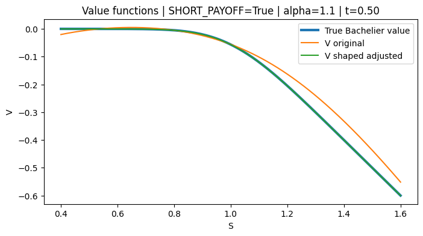
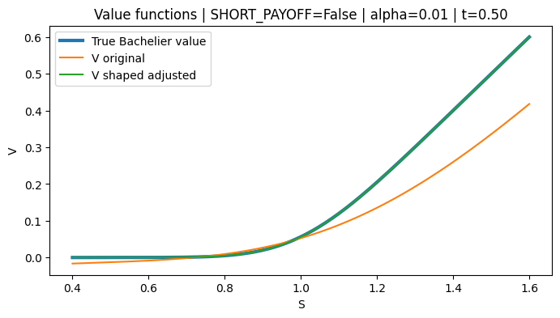
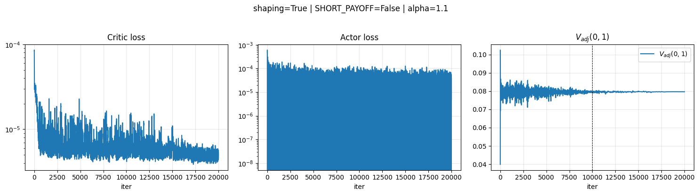
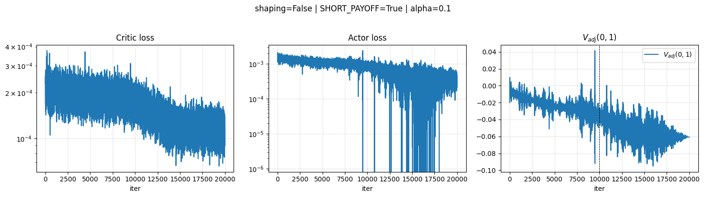
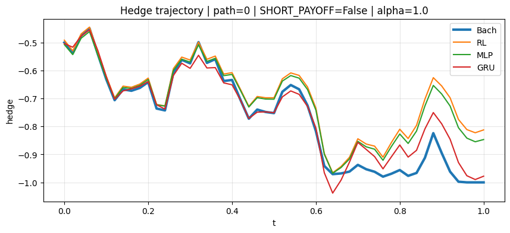
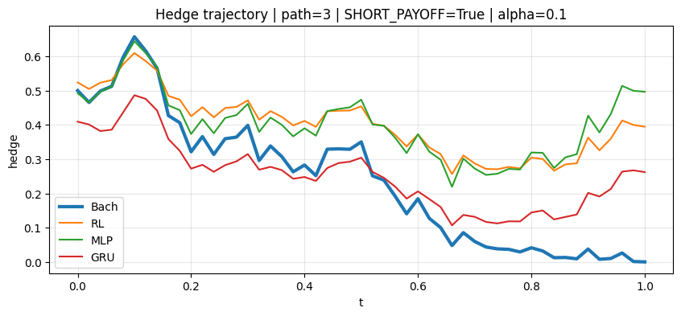

# Bachelier RL Hedging

This project is less standard than my previous ones. In fact, it is mostly homework from the VEGA institute. Still, I found it interesting because before this project I had never really worked with reinforcement learning and this repository was my first serious attempt at applying RL methods to quantitative finance problems.

The file `2201.09746.pdf` contains the main RL theory used in this project.

The main difference between reinforcement learning and supervised learning is that RL works through trial and error. An agent interacts with an environment and chooses actions in order to maximize some reward function. In finance this reward can naturally be related to PnL.

---

# Problem setup

In this project I study discrete-time hedging of a European call option.

The underlying asset follows the Bachelier model:

$$
S_t = S_0 + \mu t + \sigma W_t
$$

with:

- $S_0 = 1$
- $\mu = 0$
- $\sigma = 0.2$
- maturity $T = 1$

The time interval is divided into 50 steps.

An important remark should be made immediately: since the data itself is generated from the Bachelier model, the analytical Bachelier hedge is expected to be close to optimal.

The option payoff is:

$$
(S_T - K)^+
$$

with strike:

$$
K = 1
$$

I consider two cases:

- long payoff position (`SHORT_PAYOFF=False`)
- short payoff position (`SHORT_PAYOFF=True`)

The hedging strategy chooses a position $h_t$ in the underlying asset at every time step.

The final strategy PnL is:

$$
\Pi =
\sum_{t=0}^{T-1}
h_t (S_{t+1} - S_t)
+
\text{sign} \cdot (S_T-K)^+
$$

where:

- $\text{sign}=1$ for long payoff
- $\text{sign}=-1$ for short payoff

---

# RL approach

In the RL formulation, the reward at each step is the trading PnL:

$$
h_t (S_{t+1} - S_t)
$$

At maturity the option payoff is added.

The RL model consists of two parts:

- actor – neural network that outputs hedge position $h_t$
- critic – neural network that estimates value function $V(t,S)$

The critic is trained using temporal-difference error:

$$
\delta_t = r_t + V(t+1,S_{t+1}) - V(t,S_t)
$$

The actor is trained to minimize the risk of the final PnL.

For this purpose I use exponential utility with risk aversion parameter $\alpha$.

Larger $\alpha$ means the model penalizes large losses more aggressively and therefore reduces the variance of the final result.

---

# Interesting parts of the RL setup

What I found especially interesting is that two additional tricks are used to stabilize learning.

First, the terminal condition is imposed explicitly:

$$
V(T,S)=0
$$

because after expiration there is no future value anymore.

This reduces the space of admissible solutions and makes training more stable.

Second, reward shaping is used.

Instead of receiving all information only at maturity, the model additionally receives changes in the analytical Bachelier option price along the trajectory:

$$
\Phi(t+1,S_{t+1}) - \Phi(t,S_t)
$$

In some sense RL here acts as a correction on top of the analytical Bachelier model, almost like boosting.

---

# RL results

One important observation is that larger risk aversion $\alpha$ improves the approximation quality.

## High alpha example ($\alpha = 1.1$)

## Small alpha example

It can be seen that shaped RL becomes very close to the analytical Bachelier solution, and for large $\alpha$ it also becomes closer to the true payoff function.

Reward shaping also noticeably improves training stability.

This can be seen from actor loss dynamics and from convergence of the value function after many iterations.

## RL with reward shaping

## RL without reward shaping

Below are the RL calibration results:

| SHAPING | SHORT_PAYOFF | alpha | V0_adjusted | target |
|---|---|---|---|---|
| True | True | 0.01 | -0.079696 | -0.079788 |
| True | True | 0.10 | -0.079844 | -0.079788 |
| True | True | 1.00 | -0.079986 | -0.079788 |
| True | True | 1.10 | -0.080008 | -0.079788 |
| True | False | 0.01 | 0.079700 | 0.079788 |
| True | False | 0.10 | 0.079764 | 0.079788 |
| True | False | 1.00 | 0.079621 | 0.079788 |
| True | False | 1.10 | 0.079614 | 0.079788 |

The shaped version clearly matches the analytical Bachelier price much better.

---

# Deep Hedging models

For comparison I also implemented direct deep hedging models:

- MLP
- GRU

In this setup there is no critic and no value function.

The model directly learns the hedge strategy.

The input is the system state and the output is hedge position $h_t$.

## MLP

The MLP receives only:

$$
(t,S_t)
$$

so the hedge depends only on current time and current asset price.

## GRU

The GRU receives the whole trajectory sequence.

Therefore it can use temporal information and hidden internal state.

Unlike MLP, it can use information about previous price movements.

The final PnL is:

$$
\Pi =
\sum_t
h_t (S_{t+1}-S_t)
+
\text{payoff}
$$

The loss function is exponential utility:

$$
L =
\frac{1}{\alpha}
\mathbb{E}
\left[
e^{-\alpha \Pi} - 1
\right]
$$

This means the model optimizes not average PnL, but risk-adjusted PnL.

Large losses are penalized exponentially stronger than small losses.

As $\alpha$ increases, the model sacrifices some potential upside in order to reduce tail risk and variance.

---

# MLP results

| SHORT_PAYOFF | alpha | std |
|---|---|---|
| True | 0.01 | 0.058963 |
| True | 0.10 | 0.030130 |
| True | 1.00 | 0.023156 |
| True | 1.10 | 0.023131 |
| False | 0.01 | 0.097140 |
| False | 0.10 | 0.030868 |
| False | 1.00 | 0.022548 |
| False | 1.10 | 0.022813 |

---

# GRU results

| SHORT_PAYOFF | alpha | std |
|---|---|---|
| True | 0.01 | 0.092061 |
| True | 0.10 | 0.033472 |
| True | 1.00 | 0.018105 |
| True | 1.10 | 0.015255 |
| False | 0.01 | 0.064379 |
| False | 0.10 | 0.024023 |
| False | 1.00 | 0.014570 |
| False | 1.10 | 0.015706 |

GRU gives surprisingly good results.

This is somewhat surprising because the setup is close to Markovian, so in theory the temporal memory advantage of GRU should not matter too much.

Still, GRU hedging trajectories appear closer to the analytical Bachelier hedge than RL trajectories, both for small and large $\alpha$.

## Example  hedge trajectories

---

# Final comparison

| Method | alpha | std(PnL) |
|---|---|---|
| Bachelier delta | - | 0.0097 |
| RL + shaping | 1.0 | ~0.022 |
| MLP | 1.0 | 0.0225 |
| GRU | 1.0 | 0.0146 |

---

# Main conclusion

Since the data is generated directly from the Bachelier model, the analytical Bachelier delta hedge remains the best benchmark and is very difficult to outperform.

Overall, among the neural approaches, GRU deep hedging gave the best results in this project.

