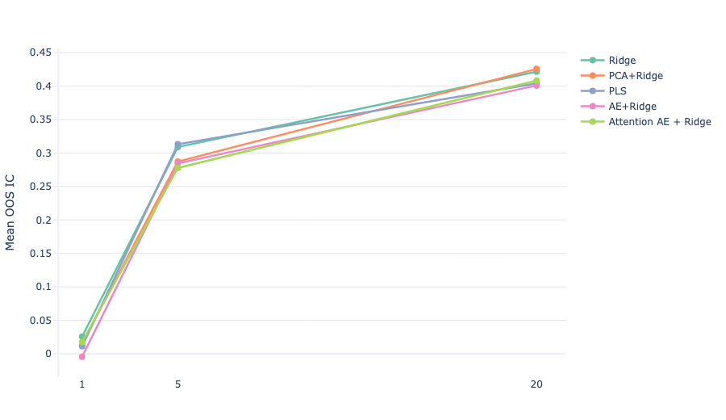
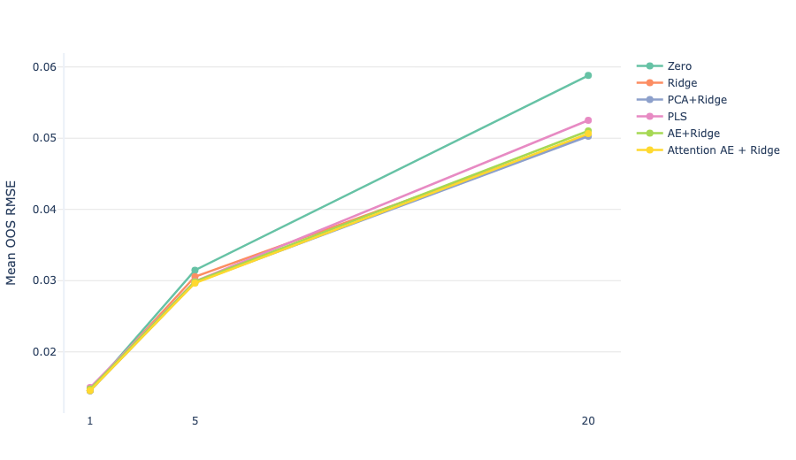

## Latent Feature Extraction: Comparative Study

### Key Findings

- No predictive signal at 1-day horizon
- Strong and stable signal at 5–20 days
- Linear models outperform or match nonlinear approaches
- PCA+Ridge provides the best trade-off between performance and interpretability
  
### Problem Setup

This project evaluates different approaches to latent feature extraction in a financial time series context.

As a case study, the target variable is the log return of copper. Features include log returns of multiple currencies as well as the US Dollar Index (DXY). Notably, lagged copper returns are intentionally excluded from the feature set in order to isolate cross-asset relationships.

A strong relationship with the US Dollar Index (DXY) is expected. The copper series is sourced as HG=F from Yahoo Finance, which tracks copper futures denominated in USD. Consequently, USD appreciation typically corresponds to lower copper prices in USD terms, and vice versa.

For other currencies, the relationship is less direct and may arise through several channels:
- changes in trade balances (especially for commodity-exporting economies),
- global risk sentiment and capital flows,
- monetary policy differentials,
- industrial demand cycles linked to regional growth,
- commodity currency effects (FX rates of countries with large metals exports).

---

## Notebooks

- [commodities_yahoo.ipynb](commodities_yahoo.ipynb) – parser for commodity prices (Yahoo Finance)
- [FX_yahoo.ipynb](FX_yahoo.ipynb) – parser for FX rates (Yahoo Finance)
- [test.ipynb](test.ipynb) – main computations (excluding attention-based autoencoder)

### Data

Daily-frequency data sourced from Yahoo Finance. The sample includes copper futures (HG=F), DXY, and a set of major FX rates (e.g., EUR, JPY, GBP, AUD, CAD, etc.). All series use daily closing prices. The sample period spans [2007-07-30, 2026-04-17].

---

### Dataset Construction

The dataset is constructed using forward return horizons <em>k ∈ {1, 5, 20}</em>.

For a target series <em>Yt</em> (log-price) and feature matrix <em>Xt</em>, the transformation is:

 Y(k)t = Yt+k − Yt  X(k)t = (Xt − Xt−k) shifted by 1 step 
 <ul> <li><em>Y(k)t</em>: forward k-period log return (target)</li> <li><em>X(k)t</em>: lagged k-period differences of features</li> <li>A one-step shift is applied to features to ensure that only information available at time <em>t−1</em> is used for prediction</li> </ul>

This produces aligned datasets Yk and Xk for each horizon, where features at time <em>t</em> are used to predict returns over <em>[t, t+k]</em>.

---

### Train/Test Splitting

An expanding window scheme is used for out-of-sample (OOS) evaluation.

Key characteristics:
- Initial training window: 2000 observations  
- Test window: 60 observations  
- Step size: 60 observations  
- Embargo: \( h - 1 \), where \( h \) is the forecast horizon  

The embargo prevents leakage between training and test sets when horizons overlap.

At each iteration:
- Training set expands  
- Test set moves forward in fixed blocks  
- No overlap contamination is allowed between train and test targets  

---

### Evaluation Metrics (OOS)

Model performance is assessed strictly out-of-sample using:

- **Spearman Information Coefficient (IC)** – rank correlation between predictions and realized returns 
- **t-statistic of IC** – statistical significance of the signal  
- **RMSE** – magnitude of prediction error (reported for completeness)  
- **R²** – explanatory power (reported for completeness) 
---

### Models Compared

- **Zero** – constant baseline  
- **Ridge** – linear model on returns  
- **PCA + Ridge** – linear latent factors  
- **PLS** – supervised factors  
- **Autoencoder (AE) + Ridge** – nonlinear latent features  
- **Attention AE + Ridge** – structured nonlinear features

- Latent dimension is fixed across PCA, PLS, and autoencoder models for fair comparison
---
### OOS Performance Summary

| Model                 | Horizon (h) | Mean IC | t-stat IC | RMSE   | R²       |
|----------------------|------------:|--------:|----------:|--------:|----------:|
| AE + Ridge           | 1           | -0.0043 | -0.2270   | 0.0148 | -0.0559  |
|                      | 5           | 0.2845  | 9.4955    | 0.0299 | -0.0085  |
|                      | 20          | 0.4009  | 6.6696    | 0.0510 | -0.2399  |
| Attention AE + Ridge | 1           | 0.0175  | 0.8388    | 0.0146 | -0.0172  |
|                      | 5           | 0.2778  | 9.8821    | 0.0297 | 0.0091   |
|                      | 20          | 0.4084  | 7.2357    | 0.0506 | -0.1941  |
| PCA + Ridge          | 1           | 0.0158  | 0.7661    | 0.0146 | -0.0170  |
|                      | 5           | 0.2874  | 10.2202   | 0.0297 | 0.0031   |
|                      | 20          | 0.4257  | 7.8387    | 0.0503 | -0.2003  |
| PLS                  | 1           | 0.0113  | 0.5921    | 0.0150 | -0.1020  |
|                      | 5           | 0.3131  | 11.1565   | 0.0299 | -0.0282  |
|                      | 20          | 0.4041  | 6.9286    | 0.0525 | -0.3201  |
| Ridge                | 1           | 0.0257  | 1.3462    | 0.0146 | -0.0183  |
|                      | 5           | 0.3089  | 11.0310   | 0.0306 | -0.0906  |
|                      | 20          | 0.4216  | 7.5876    | 0.0504 | -0.2085  |
| Zero                 | 1           | —       | —         | 0.0146 | -0.0145  |
|                      | 5           | —       | —         | 0.0315 | -0.0968  |
|                      | 20          | —       | —         | 0.0588 | -0.6149  |

### Summary

Predictive signal is essentially absent at the 1-day horizon and becomes meaningful only at 5–20 days. Across these horizons, linear approaches (Ridge, PLS, PCA+Ridge) match or outperform nonlinear models. Autoencoder-based representations, including attention variants, do not deliver a consistent or statistically meaningful improvement in out-of-sample IC.

PCA+Ridge stands out as a robust baseline, providing stable performance with competitive IC, particularly at longer horizons. In addition, PCA factors remain interpretable, which is an advantage over latent features learned by neural networks.

Differences in RMSE and R² are minor across models, indicating that these metrics are less informative in this setting.

PCA factors admit a clear economic interpretation. PC1 captures a global risk/liquidity factor, primarily driven by USD and commodity-linked currencies (AUD, NZD). 
PC2–PC3 reflect cross-sectional structure, separating safe-haven currencies (JPY, CHF) from pro-cyclical ones. 
Higher-order components capture regional and idiosyncratic variation, including emerging markets.

