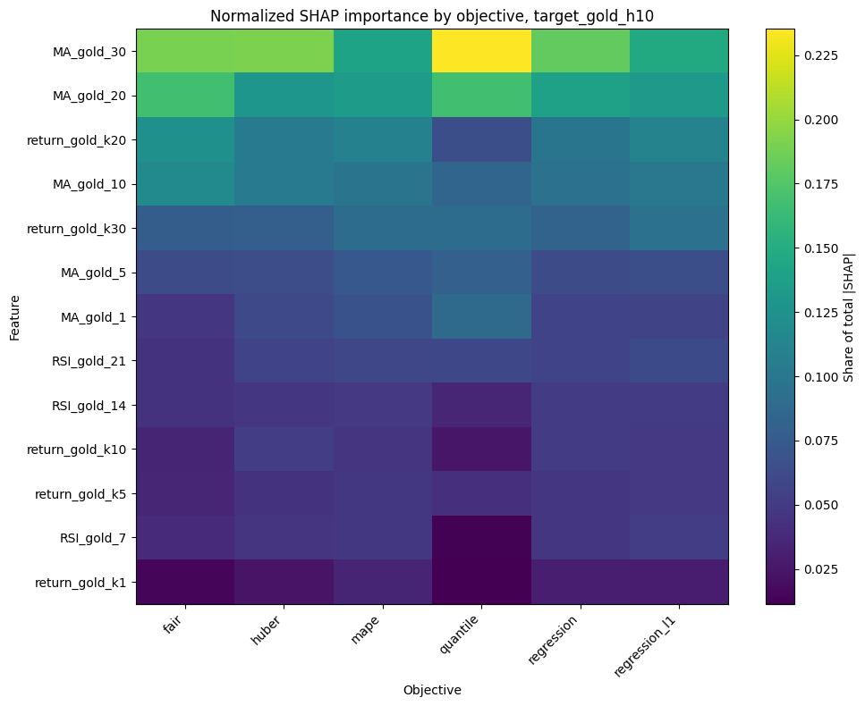
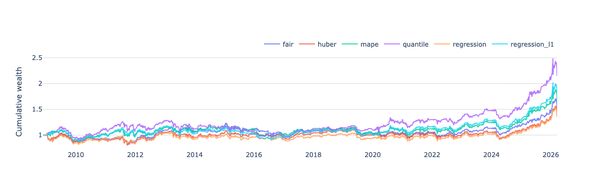

## Overview

In time series forecasting, especially with boosting models, RMSE is often used as the default objective.  
In finance, however, lower forecast error does not necessarily imply better PnL.

This project tests a simple question:

> Does the choice of loss function materially affect trading performance?

To isolate this effect, the data, features, model class, validation scheme, and trading rule are kept fixed.  
Only the LightGBM objective changes.

This is a preliminary research draft rather than a final claim about the universally best loss function.  
The current goal is to document how different objectives affect forecasts, signal structure, and backtest behavior under one controlled experimental setup.

---

## Experimental Setup

**Model**

- LightGBM
- Walk-forward validation
- Embargo = h − 1
- Optuna hyperparameter tuning
- Objective used for tuning = objective used for training
- Output: out-of-sample forecasts of h-day returns

**Data**

The experiment uses commodity futures from Yahoo Finance over the period:

**2002-01-01 – 2026-03-19**

| Sector | Futures |
|--------|---------|
| Energy | `CL=F` WTI Crude Oil, `BZ=F` Brent Crude Oil, `NG=F` Natural Gas, `RB=F` RBOB Gasoline, `HO=F` Heating Oil |
| Metals | `GC=F` Gold, `SI=F` Silver, `HG=F` Copper, `PL=F` Platinum, `PA=F` Palladium |
| Grains / Oilseeds | `ZW=F` Wheat, `ZC=F` Corn, `ZS=F` Soybeans |
| Softs | `CC=F` Cocoa, `CT=F` Cotton, `SB=F` Sugar, `KC=F` Coffee |
| Livestock | `LE=F` Live Cattle, `HE=F` Lean Hogs |

**Features**

Feature engineering is intentionally simple:

- moving averages
- RSI
- lagged returns

No fundamental features or complex transformations are used.  
The goal is to compare objectives, not to maximize raw predictive power through feature engineering.

Feature generation details: [main.ipynb](main.ipynb)

---

## Tested Loss Functions

The following LightGBM objectives are compared:

| Objective | Interpretation |
|----------|----------------|
| `regression` | L2 / RMSE-style objective |
| `regression_l1` | L1 / MAE-style objective |
| `huber` | robust hybrid between L1 and L2 |
| `fair` | smooth robust loss |
| `quantile` | conditional quantile objective |
| `mape` | relative error objective |

These objectives optimize different statistical targets.  
As a result, they may produce different forecasts, different feature importances, and different trading outcomes.

This also means that the outputs are not perfectly comparable as estimates of the same object.  
For example, L2 targets the conditional mean, L1 is closer to the conditional median, and quantile loss targets a conditional quantile.  
Therefore, the results should be interpreted as a comparison of induced trading signals, not as a pure comparison of forecast accuracy alone.

---

## Feature Importance

The loss function changes not only forecast values, but also what the model learns.

Example: mean absolute SHAP values for Gold (`GC=F`) at the 10-day horizon:

The feature ranking is not stable across objectives.  
Same data, same model class, different loss – different signal structure.

---

## Backtest

A simple trading rule is used to convert forecasts into PnL.

For each asset, horizon, and loss:

1. The model predicts h-day future return.
2. Forecasts are scaled by a recent historical threshold.
3. The signal is clipped to the range [-1, 1].
4. Positions are smoothed over the last h signals.
5. Daily PnL is computed after transaction costs.

The strategy is intentionally simple:

- no portfolio optimization
- no volatility targeting
- no leverage optimization
- no risk parity
- no signal blending

This keeps the focus on the loss function itself.

Transaction cost is set to **2 bps per unit of turnover**.

Backtest details: [forecasts_analys.ipynb](forecasts_analys.ipynb)

---

## Evaluation Metrics

For each asset, horizon, and loss, the following metrics are computed:

- IC Spearman / IC Pearson
- total return
- annualized return
- annualized volatility
- Sharpe ratio
- Sortino ratio
- maximum drawdown
- Calmar ratio
- hit rate
- VaR / CVaR
- average position size
- turnover

---

## Example: Gold, 10-Day Horizon

Cumulative PnL for Gold futures (`GC=F`) at horizon h = 10:

### Metrics

| Loss           | Sharpe | Ann.Return | Ann.Vol | MaxDD   | Calmar | IC Spearman |
|----------------|--------|------------|---------|---------|--------|-------------|
| quantile       | 0.43   | 4.59%      | 12.13%  | -25.46% | 0.18   | 0.0455      |
| regression_l1  | 0.34   | 3.36%      | 11.60%  | -22.41% | 0.15   | 0.0418      |
| mape           | 0.32   | 3.06%      | 11.61%  | -21.82% | 0.14   | 0.0473      |
| fair           | 0.27   | 2.37%      | 11.15%  | -20.77% | 0.11   | 0.0671      |
| huber          | 0.22   | 1.86%      | 11.09%  | -23.40% | 0.08   | 0.0559      |
| regression     | 0.21   | 1.77%      | 11.07%  | -21.79% | 0.08   | 0.0480      |

In this example, `quantile` delivers the highest Sharpe and annualized return under the chosen trading rule, while the standard RMSE-style objective (`regression`) is the weakest among active strategies.

Also note that the highest IC does not correspond to the best trading result: `fair` has the highest IC Spearman, but weaker Sharpe than `quantile`.

This example should not be interpreted as evidence that `quantile` is universally superior.  
It shows that the objective can materially change the resulting trading signal and that forecast-quality metrics and trading metrics may rank models differently.

---

## Key Findings

Several patterns appear across assets and horizons.

**1. RMSE is not always aligned with trading performance**

The default `regression` objective is not consistently the best choice in terms of Sharpe or total return under this setup.  
Minimizing squared forecast error is not the same as maximizing risk-adjusted PnL.

**2. Quantile loss is often competitive, but not universally optimal**

`quantile` frequently ranks among the better objectives across multiple assets and horizons, and in several cases delivers the highest Sharpe.

However, its performance is not stable across all settings:

- the best loss varies across assets
- for the same asset, the preferred loss can change with the forecast horizon
- part of the result may depend on how forecasts are scaled into positions

This indicates that no single objective dominates in this experiment.  
While modeling conditional asymmetry can be useful, the preferred loss remains context-dependent.

**3. IC and PnL are different objects**

Higher IC does not always lead to higher Sharpe.  
Trading performance also depends on forecast scale, position sizing, turnover, drawdowns, and tail behavior.

**4. The best loss depends on asset and horizon**

There is no universally dominant objective.  
For example, Gold behaves differently at h = 5, h = 10, and h = 20, while Copper and energy contracts show their own horizon-specific patterns.

**5. Some objectives can produce inactive strategies**

For some assets and horizons, certain losses lead to zero or near-zero positions.  
These cases are kept in the results because they are part of the experiment: the objective can affect whether the model produces a tradable signal at all.

---

## Current Limitations and Next Checks

This repository is currently a research draft.  
Before making stronger conclusions, several checks are still needed:

1. **Signal normalization**

   Different objectives produce forecasts with different distributions and scales.  
   A useful robustness check is to map all forecasts into a common signal space, for example by using ranks, z-scores, or volatility-adjusted signals.

2. **Forecast calibration**

   Since the objectives target different statistical quantities, their outputs are not identical types of forecasts.  
   Additional calibration may be needed before comparing them as trading signals.

3. **Statistical significance**

   Differences in Sharpe ratios and returns should be tested using methods such as block bootstrap, White’s Reality Check, or SPA-style tests.

4. **Subperiod robustness**

   Results should be checked across different market regimes, for example pre-2010, 2010–2019, COVID period, and post-2020.

5. **Transaction cost sensitivity**

   The current backtest uses 2 bps per unit of turnover.  
   Results should be tested under higher and lower cost assumptions.

6. **Hyperparameter tuning policy**

   The current setup tunes each model using the same objective as the training loss.  
   A useful robustness check is to compare this against fixed hyperparameters or tuning based on a common validation metric.

7. **Scaling rule sensitivity**

   Since forecasts are converted into positions through a historical threshold, the trading results may depend on this mapping.  
   Alternative position-sizing rules should be tested.

---

## Conclusion

The main result is preliminary but clear within this setup: the loss function matters.

Even with fixed data, features, model class, validation scheme, and trading rule, changing only the objective leads to different:

- feature importances
- forecast distributions
- turnover profiles
- drawdowns
- Sharpe ratios
- PnL paths

RMSE is convenient, but it is not necessarily aligned with financial performance.  
In this experiment, robust and asymmetric objectives — especially `quantile` in several cases — often produce more attractive trading results than the standard squared-error objective.

However, these findings should be interpreted as evidence that loss functions can materially affect trading outcomes, not as proof that one objective is universally superior.  
Further robustness checks are needed before drawing stronger conclusions.
