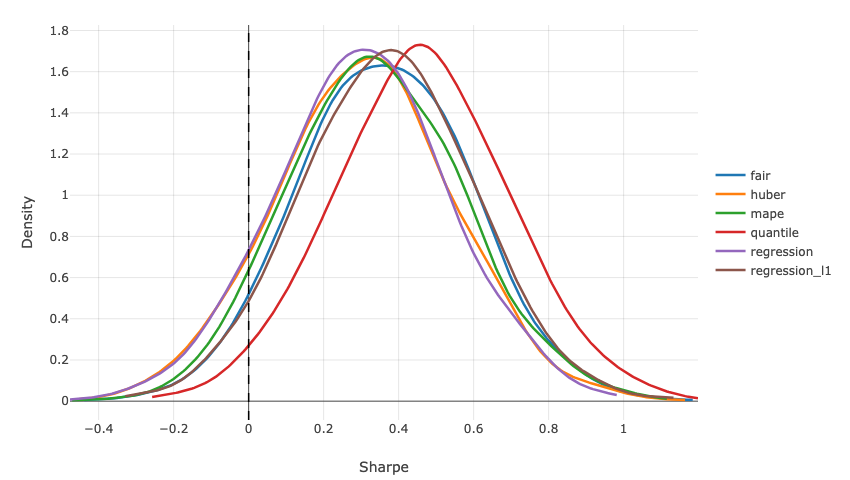
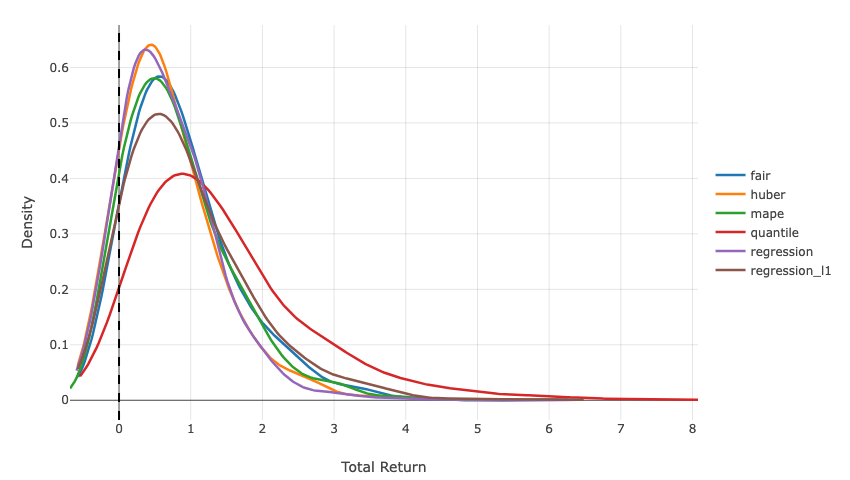
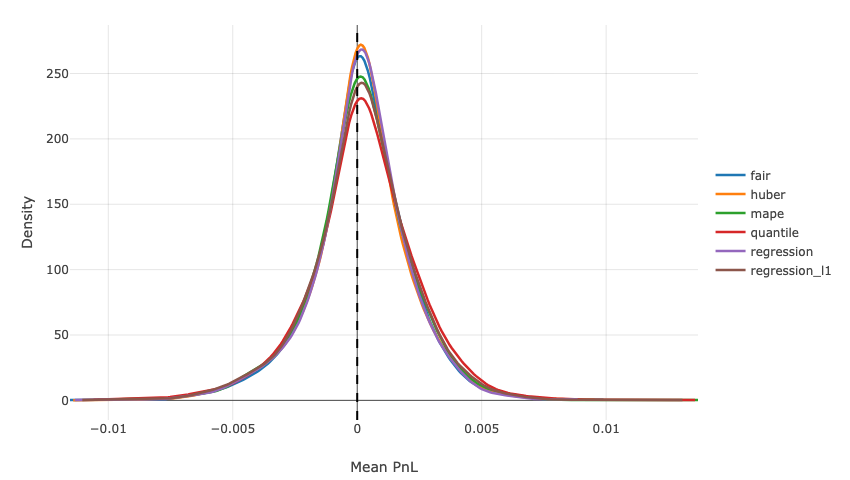
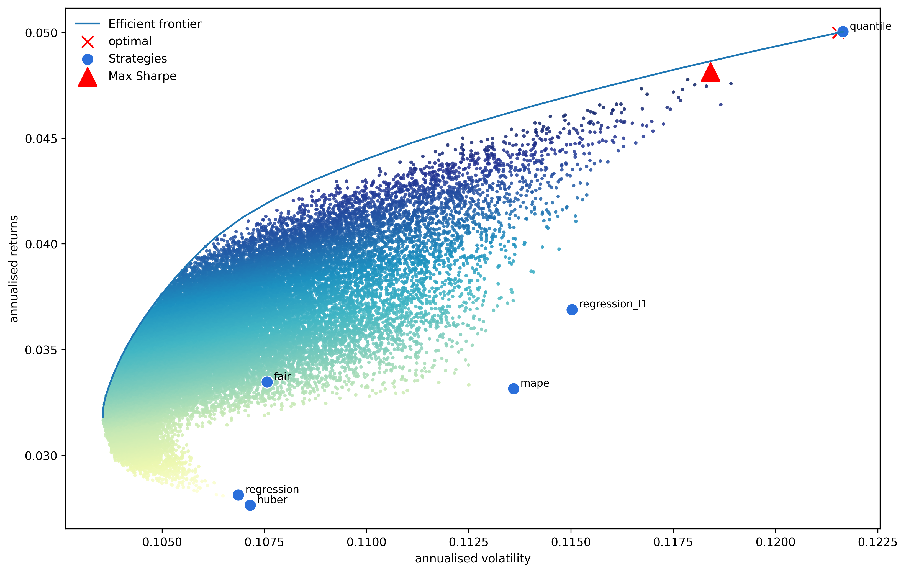
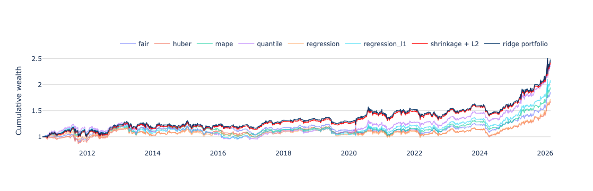

## Overview

In time series forecasting, especially with boosting models, RMSE is often used as the default objective.  
In finance, however, lower forecast error does not necessarily imply better PnL.

This project tests a simple question:

> Does the choice of loss function materially affect trading performance?

To isolate this effect, the data, features, model class, validation scheme, and trading rule are kept fixed.  
Only the LightGBM objective changes.

This is a preliminary research draft rather than a final claim about the universally best loss function.  
The current goal is to document how different objectives affect forecasts, signal structure, and backtest behavior under one controlled experimental setup.

---

## Experimental Setup

**Model**

- LightGBM
- Walk-forward validation
- Embargo = h − 1
- Optuna hyperparameter tuning
- Objective used for tuning = objective used for training
- Output: out-of-sample forecasts of h-day returns

**Data**

The experiment uses commodity futures from Yahoo Finance over the period:

**2002-01-01 – 2026-03-19**

| Sector | Futures |
|--------|---------|
| Energy | `CL=F` WTI Crude Oil, `BZ=F` Brent Crude Oil, `NG=F` Natural Gas, `RB=F` RBOB Gasoline, `HO=F` Heating Oil |
| Metals | `GC=F` Gold, `SI=F` Silver, `HG=F` Copper, `PL=F` Platinum, `PA=F` Palladium |
| Grains / Oilseeds | `ZW=F` Wheat, `ZC=F` Corn, `ZS=F` Soybeans |
| Softs | `CC=F` Cocoa, `CT=F` Cotton, `SB=F` Sugar, `KC=F` Coffee |
| Livestock | `LE=F` Live Cattle, `HE=F` Lean Hogs |

**Features**

Feature engineering is intentionally simple:

- moving averages
- RSI
- lagged returns

No fundamental features or complex transformations are used.  
The goal is to compare objectives, not to maximize raw predictive power through feature engineering.

Feature generation details: `main.ipynb`

---

## Tested Loss Functions

The following LightGBM objectives are compared:

| Objective | Interpretation |
|----------|----------------|
| `regression` | L2 / RMSE-style objective |
| `regression_l1` | L1 / MAE-style objective |
| `huber` | robust hybrid between L1 and L2 |
| `fair` | smooth robust loss |
| `quantile` | conditional quantile objective |
| `mape` | relative error objective |

These objectives optimize different statistical targets.  
As a result, they may produce different forecasts, different feature importances, and different trading outcomes.

This also means that the outputs are not perfectly comparable as estimates of the same object.  
For example, L2 targets the conditional mean, L1 is closer to the conditional median, and quantile loss targets a conditional quantile.  
Therefore, the results should be interpreted as a comparison of induced trading signals, not as a pure comparison of forecast accuracy alone.

---

## Feature Importance

The loss function changes not only forecast values, but also what the model learns.

Example: mean absolute SHAP values for Gold (`GC=F`) at the 10-day horizon:

The feature ranking is not stable across objectives.  
Same data, same model class, different loss – different signal structure.

---

## Backtest

A simple trading rule is used to convert forecasts into PnL.

Before positions are constructed, forecasts are normalized to make signals comparable across loss functions:

  <code>y_norm_t = y_hat_t / EWMA(|y_hat_t|)</code>

This reduces the effect of scale differences between objectives.

For each asset, horizon, and loss, the model predicts h-day future returns, normalizes the forecast, maps it into a clipped signal in [-1, 1], smooths positions over the last h signals, and computes daily PnL after transaction costs.

The strategy is intentionally simple: no portfolio optimization, volatility targeting, leverage optimization, risk parity, or signal blending. This keeps the focus on the loss function itself.

Transaction cost is set to **2 bps per unit of turnover**.

Backtest details: `forecasts_analys_v2.ipynb`

---

## Evaluation Metrics

For each asset, horizon, and loss, the following metrics are computed:

- IC Spearman / IC Pearson
- total return
- annualized return
- annualized volatility
- Sharpe ratio
- Sortino ratio
- maximum drawdown
- Calmar ratio
- hit rate
- VaR / CVaR
- average position size
- turnover

---

## Example: Gold, 10-Day Horizon

Cumulative PnL for Gold futures (`GC=F`) at horizon h = 10:

### Metrics

| Loss           | Sharpe | Ann.Return | Ann.Vol | MaxDD   | Calmar | IC Spearman |
|----------------|--------|------------|---------|---------|--------|-------------|
| quantile       | 0.43   | 4.59%      | 12.13%  | -25.46% | 0.18   | 0.0455      |
| regression_l1  | 0.34   | 3.36%      | 11.60%  | -22.41% | 0.15   | 0.0418      |
| mape           | 0.32   | 3.06%      | 11.61%  | -21.82% | 0.14   | 0.0473      |
| fair           | 0.27   | 2.37%      | 11.15%  | -20.77% | 0.11   | 0.0671      |
| huber          | 0.22   | 1.86%      | 11.09%  | -23.40% | 0.08   | 0.0559      |
| regression     | 0.21   | 1.77%      | 11.07%  | -21.79% | 0.08   | 0.0480      |

In this example, `quantile` delivers the highest Sharpe and annualized return under the chosen trading rule, while the standard RMSE-style objective (`regression`) is the weakest among active strategies.

Also note that the highest IC does not correspond to the best trading result: `fair` has the highest IC Spearman, but weaker Sharpe than `quantile`.

This example should not be interpreted as evidence that `quantile` is universally superior.  
It shows that the objective can materially change the resulting trading signal and that forecast-quality metrics and trading metrics may rank models differently.

---
### Statistical Significance Check

To check whether the differences across losses are statistically meaningful, a block bootstrap was applied. A block bootstrap is used because daily PnL and trading signals are time-dependent, so the temporal structure should be partially preserved.

The check was done for both Sharpe ratios and cumulative PnL.

Sharpe ratio bootstrap density:

Cumulative PnL bootstrap density:

Visually, the bootstrap densities are close to each other. The tests also do not show statistically significant differences in Sharpe ratios across loss functions.

One possible reason is that the experiment uses only price-based features from the same asset. In that setting, the model may have limited ability to forecast returns in the first place.

Still, the losses do not produce identical signals or identical PnL paths. Even if the Sharpe differences are not statistically significant, the fact that the models behave differently may still be useful from a risk diversification perspective. This is discussed further below.

---
## Alpha Aggregation and Markowitz

Different objectives produce different signals and make different errors.  
Aggregating them can improve stability and diversify model risk.

Example (signals and weights):

| Loss        | Signal | Weight |
|------------|--------|--------|
| quantile   | +1.0   | 0.5    |
| fair       | 0.0    | 0.3    |
| huber      | -1.0   | 0.2    |

  <code>position = Σ w_i · s_i = 0.5·1.0 + 0.3·0.0 + 0.2·(-1.0) = 0.3</code>

Before applying mean-variance optimization, the distribution of average returns is checked:

The distribution empirically close to Gaussian, so the Markowitz framework is a reasonable approximation.

Weights are obtained from a mean-variance setup targeting the tangency portfolio:

Since all alphas are derived from the same data and model class, they are highly correlated, which makes covariance estimation unstable.  
A shrinkage estimator (Ledoit–Wolf) is used, followed by additional diagonal regularization:

  <code>Sigma_reg = Sigma_LW + gamma · c · I</code>

where <code>c</code> is the average variance (mean of the diagonal of <code>Sigma_LW</code>).  
The parameter <code>gamma</code> controls the strength of regularization and is selected on a validation window by maximizing Sharpe.

The full evaluation is performed in a walk-forward manner.

Even without statistically significant differences in Sharpe across individual losses, the signals are not identical.  
Aggregation reduces model-specific noise and can improve the stability of the resulting strategy.

---

## Alpha Aggregation with a Meta Model

Another way to aggregate signals is to treat individual loss-based strategies as inputs to a meta model.

The setup is close to the Markowitz approach: each loss produces its own alpha, and the final position is a weighted combination of these alphas. Since the alphas are highly correlated, regularization is required to obtain stable weights.

Here a ridge-regularized allocation is used. The optimizer targets maximum Sharpe while penalizing large weights:

  <code>max Sharpe(w) - gamma · ||w||²</code>

with long-only constraints:

  <code>w_i ≥ 0, &nbsp; Σ w_i = 1</code>

The ridge term reduces concentration and stabilizes the solution across windows.

The regularization parameter <code>gamma</code> is selected on a validation window by maximizing Sharpe.  
The full procedure is implemented in a walk-forward manner: weights are estimated on train, tuned on validation, refit on train+validation, and applied out-of-sample.

The resulting portfolio PnL is:

  <code>portfolio_pnl_t = Σ w_i · pnl_{i,t}</code>

This can be viewed as a simple meta-model over loss-specific alphas.  
It allows the allocation to adapt over time while controlling overfitting through regularization.

---

## Portfolio Results

As expected, aggregating alphas improves risk-adjusted performance.

Cumulative PnL from the walk-forward procedure:

### Metrics

| Strategy           | Sharpe | Ann.Return | Ann.Vol | MaxDD   | Calmar |
|--------------------|--------|------------|---------|---------|--------|
| fair               | 0.4205 | 4.45%      | 10.59%  | -20.46% | 0.22   |
| huber              | 0.3635 | 3.84%      | 10.58%  | -17.29% | 0.22   |
| mape               | 0.4322 | 4.88%      | 11.28%  | -21.34% | 0.23   |
| quantile           | 0.5231 | 6.32%      | 12.08%  | -25.46% | 0.25   |
| regression         | 0.3762 | 3.96%      | 10.52%  | -16.75% | 0.24   |
| regression_l1      | 0.4660 | 5.33%      | 11.43%  | -22.41% | 0.24   |
| Shrinkage + L2     | 0.5496 | 6.39%      | 11.62%  | -15.58% | 0.41   |
| Ridge              | 0.5599 | 6.49%      | 11.59%  | -15.67% | 0.41   |

Both aggregation approaches outperform individual losses in Sharpe and drawdown-adjusted metrics.

The improvement is moderate but consistent, suggesting that combining loss-specific signals helps reduce model-specific noise and stabilize returns.

Implementation details: `portfolio_opt.ipynb`

---

## Conclusions

The statistical power of the experiment is limited, likely due to the simplicity of the setup and the use of only price-based features. However, even in this setting, different loss functions produce different financial outcomes. This suggests that using RMSE (`regression`) by default is not necessarily optimal from a trading perspective.

Different objectives generate non-identical signals, which makes them useful for diversification. Aggregating loss-specific alphas improves stability and leads to better risk-adjusted performance compared to individual models.

IC and PnL capture different properties. Higher IC does not necessarily translate into higher Sharpe. Trading performance also depends on forecast scaling, position sizing, turnover, drawdowns, and tail behavior.

Finally, the choice of loss function affects feature importance. Even with the same data and model class, different objectives lead to different representations of the signal, reinforcing that the loss function is not a neutral modeling choice.
