# How Optuna Samplers Affect Model Accuracy, Stability, and Financial Results

## Overview

I continue my series of experiments on factors that can affect model accuracy and stability.

In a previous experiment, I studied the effect of different loss functions. This time, I focused on hyperparameter optimization.

For this experiment, I used `CatBoostRegressor` with basic features and no additional transformations. The complete implementation and experiment details are available in [`CTB_r.ipynb`](CTB_r.ipynb).

## Optuna Samplers

Optuna is currently one of the de facto industry standards for hyperparameter optimization.

Previously, I used Optuna mostly out of the box and did not pay much attention to what happens inside the framework. In practice, Optuna has two important components.

A **sampler** proposes new hyperparameter values. A **pruner** defines when an unpromising trial should be stopped.

The official Optuna documentation is available here:

https://optuna.readthedocs.io/en/stable/index.html

The table below gives a short comparison of the samplers used in this experiment.

| Sampler | Main idea | Approximate complexity | Best use case |
|---|---|---:|---|
| `TPESampler` | Builds probability models for successful and unsuccessful trials | Approximately \(O(nd)\) per suggestion | General-purpose optimization, including mixed and conditional spaces |
| `CmaEsSampler` | Updates a multivariate search distribution using an evolutionary strategy | Approximately \(O(d^2)\), with some operations up to \(O(d^3)\) | Continuous and correlated parameters |
| `GPSampler` | Fits a Gaussian process and optimizes an acquisition function | Approximately \(O(n^3)\) | Expensive objectives with a small number of parameters |
| `QMCSampler` | Uses low-discrepancy sequences for more uniform space coverage | Approximately \(O(d)\) per point | Fast exploration of bounded low-dimensional spaces |

Here, \(n\) is the number of completed trials and \(d\) is the number of optimized hyperparameters.

These complexity estimates are approximate and describe only the sampler. They do not include CatBoost training time, which is the main part of the total runtime.

## Experimental Setup

Each sampler received the same optimization budget:

```python
n_trials = 50
```

For CatBoost and this dataset, 50 trials may not have been enough for every sampler to converge to the global minimum. However, using the same number of trials makes it possible to compare the samplers under equal conditions.

This comparison is useful because the final metric is not always the only important result. In some tasks, optimization speed also matters.

The following samplers were tested:

```python
TPESampler
CmaEsSampler
QMCSampler
GPSampler
```

## Model Performance

| Sampler | Runtime | Mean test MSE | Best validation MSE | Best hyperparameters |
|---|---:|---:|---:|---|
| TPE | `01:51` | `2.643269799551566e-05` | `2.5426261120276945e-05` | `learning_rate=0.076577`, `depth=6`, `l2_leaf_reg=6.510820` |
| CMA-ES | `01:57` | `2.6854220502672674e-05` | **`2.5424518296674126e-05`** | `learning_rate=0.100334`, `depth=6`, `l2_leaf_reg=7.166932` |
| QMC | `02:26` | `2.738202942155653e-05` | `2.5433399633620987e-05` | `learning_rate=0.070035`, `depth=6`, `l2_leaf_reg=1.160221` |
| GP | `02:03` | **`2.637836226003621e-05`** | `2.542946131400749e-05` | `learning_rate=0.150000`, `depth=4`, `l2_leaf_reg=30.000000` |

Under the fixed budget of 50 trials, GP produced the lowest mean test MSE, while CMA-ES produced the lowest validation MSE. TPE was the fastest sampler, and QMC required the most time.

The differences between the best validation MSE values are very small. The differences in mean test MSE are more visible. This suggests that the best validation result alone may not fully describe out-of-sample performance and stability.

## Diebold–Mariano Test

For a more statistically rigorous comparison, I applied the Diebold–Mariano test to the forecast errors.

| Model 1 | Model 2 | DM statistic | p-value |
|---|---|---:|---:|
| GPS | CMAES | `18.465589` | `0.000000e+00` |
| GPS | TPE | `9.934415` | `0.000000e+00` |
| GPS | QMC | `7.001669` | `2.529310e-12` |
| CMAES | TPE | `-13.278605` | `0.000000e+00` |
| CMAES | QMC | `-15.894836` | `0.000000e+00` |
| TPE | QMC | `-1.550069` | `1.211249e-01` |

At the 5% significance level, the null hypothesis of equal predictive accuracy is rejected for every pair except TPE and QMC.

For this pair, the p-value is approximately `0.1211`, so there is not enough statistical evidence to conclude that their predictive accuracy is different.

The sign of the DM statistic depends on the order of the models and on the definition of the loss differential. It should therefore be interpreted together with the exact implementation of the test.

## TPE Results

### Contour Plot

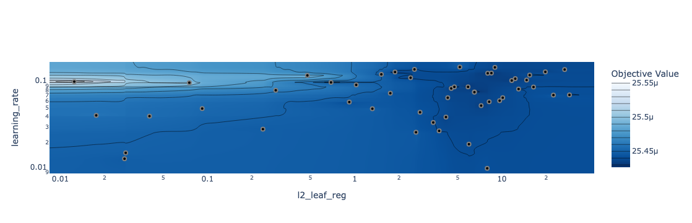

The contour plot shows that the final loss depends strongly on the selected hyperparameter values. Even in a relatively small search space, different combinations of `learning_rate`, `depth`, and `l2_leaf_reg` produce different results.

### Optimization History

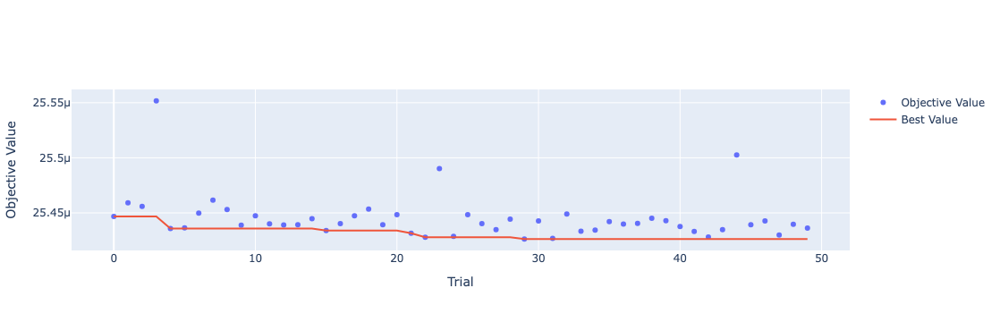

This plot shows the objective value for each trial. It makes it possible to see how quickly the sampler finds a strong solution and whether the optimization appears to stabilize within the available number of trials.

### Hyperparameter Combinations

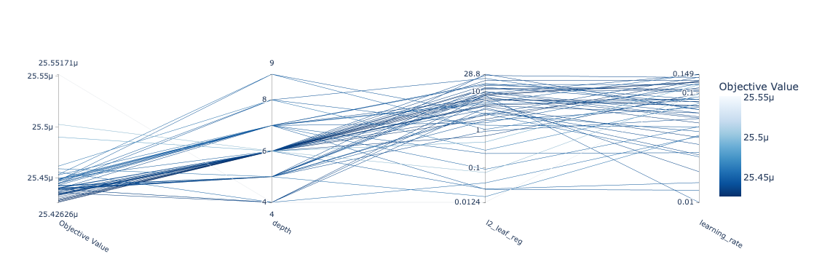

This figure shows the relationship between sampled hyperparameter combinations and the final loss.

The result also shows that hyperparameters should not always be analyzed independently. A value that works well in one combination may perform worse when combined with different values of the other parameters.

### Hyperparameter Importance

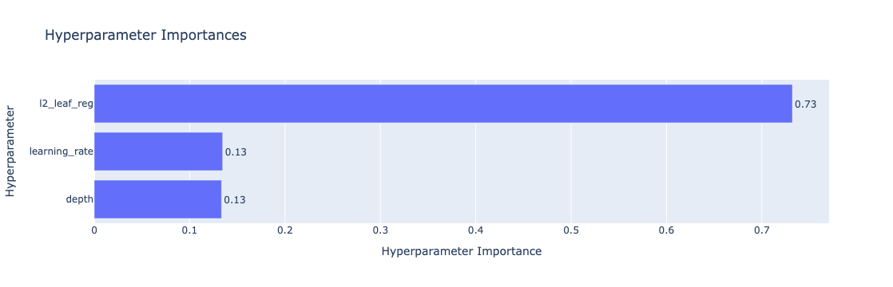

This figure shows the estimated importance of the optimized hyperparameters for the TPE study.

## Hyperparameter Importance Across Samplers

The estimated importance of the same hyperparameters changes depending on the sampler.

### QMC

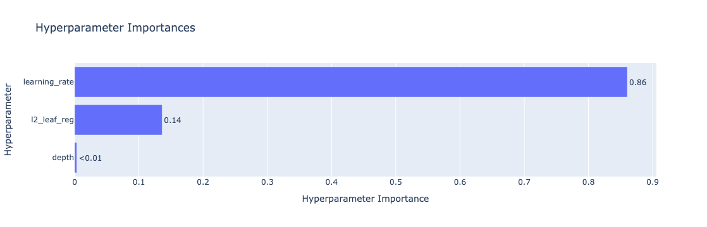

### CMA-ES

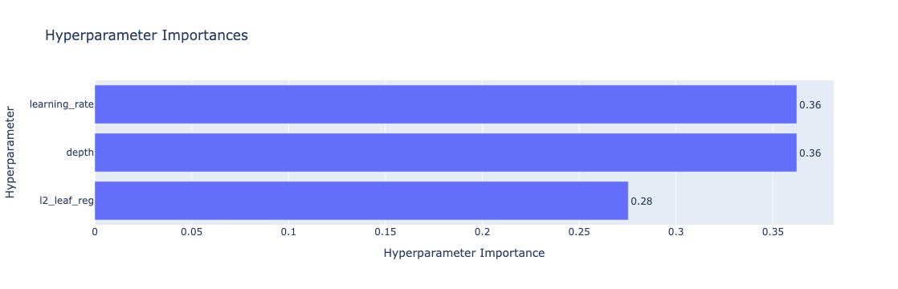

### GP

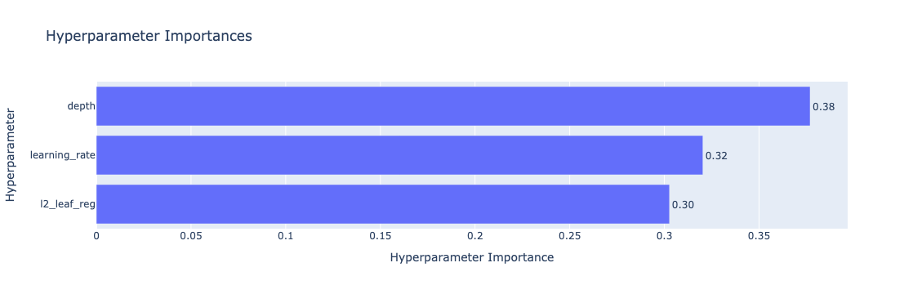

This does not necessarily mean that the real dependence of CatBoost on these hyperparameters changes.

Hyperparameter importance is estimated from the trials generated within a particular study. Since different samplers explore different parts of the search space, they produce different samples of hyperparameter combinations. As a result, the estimated importance may also be different.

## Convergence Speed

The samplers also differ in their convergence behavior.

### CMA-ES

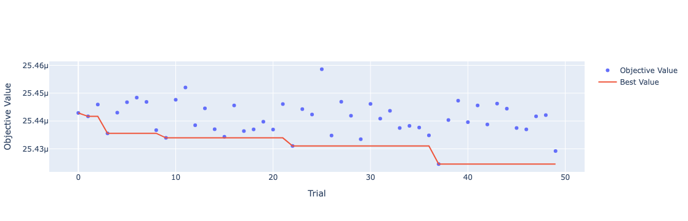

### GP

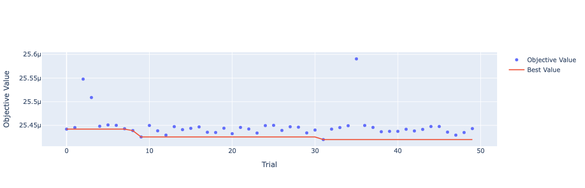

### QMC

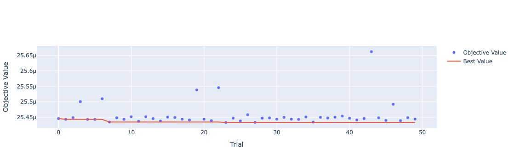

The same number of trials does not mean that the optimization process is identical.

Different samplers explore different regions of the search space and find their best configurations at different stages. Some samplers may stabilize quickly, while others may require a larger trial budget.

For this reason, both wall-clock runtime and convergence by trial should be considered when comparing samplers.

## Financial Results

I also tested whether the sampler choice affects the final financial results.

The same simple trading rule was used for every model. The entry and exit thresholds were selected as optimal quantiles of the out-of-sample predictions.

| Model | Sharpe | Sortino | Max Drawdown |
|---|---:|---:|---:|
| GPS | `0.487` | `0.179` | `-0.189` |
| CMAES | `0.840` | `0.296` | `-0.190` |
| TPE | **`0.901`** | **`0.312`** | `-0.200` |
| QMC | `0.336` | `0.127` | **`-0.187`** |

The ranking based on financial metrics is different from the ranking based on MSE.

GP produced the lowest mean test MSE, but it did not produce the highest Sharpe or Sortino ratio. TPE produced the strongest risk-adjusted returns, while CMA-ES showed results close to TPE with a slightly smaller drawdown. QMC had the smallest drawdown in absolute terms, but its Sharpe and Sortino ratios were the weakest.

This happens because a lower forecasting error does not automatically lead to a better trading strategy.

MSE measures the average squared prediction error. Financial results also depend on the sign and timing of predictions, their ranking, the distribution of errors, the selected thresholds, the number of trades, and downside risk.

The sampler affects the selected hyperparameters. The hyperparameters affect the model predictions. These changes affect the optimal entry and exit thresholds and can therefore change the final trading results.

## Conclusion

At first, the sampler may appear less important than a modelling decision such as the loss function. In practice, this is not always true.

With the same number of trials, different samplers produced different optimal CatBoost parameters, different out-of-sample errors, different convergence patterns, different hyperparameter-importance estimates, and different financial results.

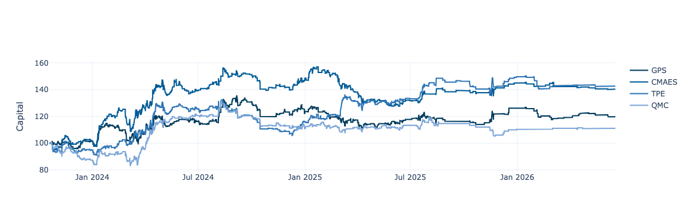

The sampler should therefore be treated as part of the modelling pipeline rather than only as a technical implementation detail.

A stronger comparison would require more trials and several repeated experiments with different random seeds. This would make it possible to separate systematic differences between the samplers from randomness in the optimization process.

## Target and Validation Methodology

The target variable was the non-overlapping one-hour Bitcoin return.

A new prediction and trading decision were made once per hour.

The model was evaluated using a walk-forward procedure with separate training, validation, and test periods.

The trading thresholds were estimated using already generated out-of-sample predictions. A separate walk-forward procedure was used for threshold selection to avoid any form of information leakage.

At every point in time, the model and the trading rule used only information that would have been available at that moment. This time-aware evaluation procedure was applied both to model selection and to the calibration of the entry and exit thresholds.
