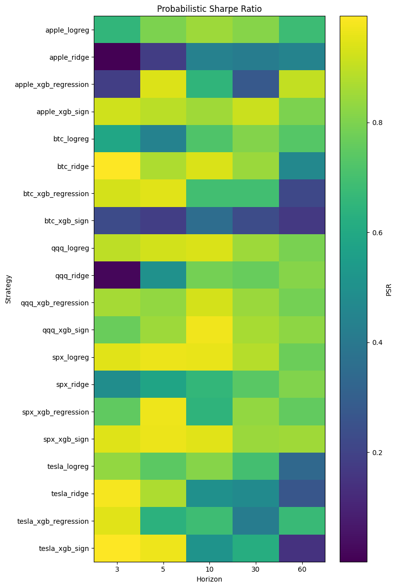
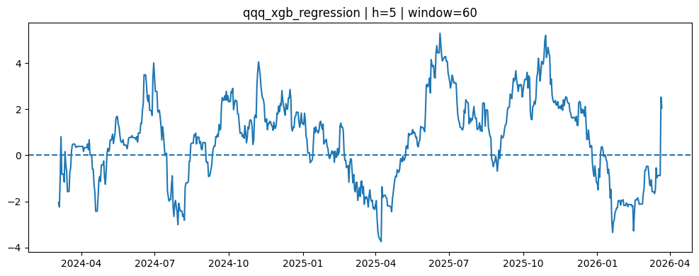

# How to Test Forecasts Properly

Today I want to look at a practical question: how should we test different forecasts in a reasonable way?

I still do not have a fixed checklist of tests that I always use, so this project will probably be extended over time. I start with the classification case. A more detailed problem setup can be found in my previous project: `directional-vs-return-prediction`.

## Classification

Looking only at accuracy is usually not enough. Accuracy does not handle class imbalance well.

For example, if the market mostly goes up, a classifier that always predicts class `1` (`long`) may have high accuracy, even if it does not learn anything useful.

A better metric for binary classification is the Matthews Correlation Coefficient, or MCC:

<p align="center">
  
</p>

MCC is useful because it uses all four parts of the confusion matrix: true positives, true negatives, false positives, and false negatives.

In my case, after aggregating MCC by assets and horizons, I get:

| model | horizon | mean | std | count |
|---|---:|---:|---:|---:|
| logreg | 3 | -0.0045 | 0.0203 | 5 |
| logreg | 5 | -0.0175 | 0.0346 | 5 |
| logreg | 10 | -0.0292 | 0.0444 | 5 |
| logreg | 30 | -0.0165 | 0.0918 | 5 |
| logreg | 60 | -0.0418 | 0.0645 | 5 |
| xgb | 3 | 0.0206 | 0.0305 | 5 |
| xgb | 5 | 0.0234 | 0.0340 | 5 |
| xgb | 10 | 0.0109 | 0.0345 | 5 |
| xgb | 30 | -0.0313 | 0.0737 | 5 |
| xgb | 60 | 0.0099 | 0.1533 | 5 |

The interpretation is not very strong. Most MCC values are close to zero. This means that the classifiers are not much better than a random directional signal. XGBoost looks slightly better on short horizons, but the effect is small and unstable.

## F1 Score

Another useful metric is the F1 score:

<p align="center">
  
</p>

F1 score is the harmonic mean between precision and recall. It partially solves the problem of class imbalance because it does not reward a model only for predicting the dominant class.

In this case, it is better to split the problem into two separate views:

- how well the model predicts `long`;
- how well the model predicts `short`.

The results are:

| model | horizon | long | short |
|---|---:|---:|---:|
| logreg | 3 | 0.6426 | 0.0757 |
| logreg | 5 | 0.6502 | 0.0739 |
| logreg | 10 | 0.6761 | 0.0666 |
| logreg | 30 | 0.6871 | 0.0948 |
| logreg | 60 | 0.7366 | 0.1558 |
| xgb | 3 | 0.6129 | 0.2933 |
| xgb | 5 | 0.6268 | 0.2927 |
| xgb | 10 | 0.6416 | 0.2950 |
| xgb | 30 | 0.6443 | 0.2726 |
| xgb | 60 | 0.7028 | 0.2740 |

The classifier is clearly much better at predicting the `long` class than the `short` class. This suggests that the models are biased toward predicting `long`.

Logistic regression has especially weak F1 scores for the short side. XGBoost is better, but still far from strong.

## Recall

Recall is also useful:

<p align="center">
  
</p>

Recall shows what fraction of actual positive cases the model was able to find.

The results are:

| model | horizon | long | short |
|---|---:|---:|---:|
| logreg | 3 | 0.9574 | 0.0416 |
| logreg | 5 | 0.9443 | 0.0414 |
| logreg | 10 | 0.9466 | 0.0369 |
| logreg | 30 | 0.9271 | 0.0546 |
| logreg | 60 | 0.9170 | 0.0962 |
| xgb | 3 | 0.8153 | 0.2155 |
| xgb | 5 | 0.8221 | 0.2132 |
| xgb | 10 | 0.8018 | 0.2195 |
| xgb | 30 | 0.7840 | 0.2040 |
| xgb | 60 | 0.8140 | 0.2083 |

Again, the same pattern is visible. The models catch many `long` cases, but they miss most `short` cases.

This means that the model is not symmetric. It mostly wants to stay long.

## Regression Forecasts

For regression, in my case prediction of log returns, one possible test is the Clark-West test, which I discussed earlier.

However, a more standard baseline is the Diebold-Mariano test.

The null hypothesis is:

<p align="center">
  
</p>

where

<p align="center">
  
</p>

In words: under the null hypothesis, two forecasts have equal predictive accuracy.

My results are:

| horizon | dm_stat | p_value | significant_5pct | 5pct |
|---:|---:|---:|---|---|
| 3 | 1.3728 | 0.1698 | False | False |
| 5 | 1.5184 | 0.1289 | False | False |
| 10 | 1.7991 | 0.0720 | False | False |
| 30 | 3.3954 | 0.0007 | True | True |
| 60 | 1.2271 | 0.2198 | False | False |

Most horizons are not statistically significant at the 5% level. The only exception is horizon `30`, where the null of equal predictive accuracy is rejected.

## Testing Alphas and Sharpe Ratios

When we move from forecasts to alphas, meaning PnL streams generated by the models, another problem appears.

Suppose I have:

- 1 asset;
- 1 prediction horizon;
- 2 model classes;
- 30 Optuna trials for each model.

Then I do not really compare only 2 models. I compare 2 selected realizations out of:

<p align="center">
  
</p>

model / hyperparameter combinations.

If each combination has a 1% probability of producing a high Sharpe ratio just by luck, then the probability that at least one of the 60 combinations looks good by chance is:

<p align="center">
  
</p>

So the problem: with many trials, it becomes very likely that something will look good in the backtest just by chance.

One way to correct for this is the Deflated Sharpe Ratio, or DSR.

A simplified expression is:

<p align="center">
  
</p>

where:

- `T` is the number of observations;
- `gamma_3` is skewness;
- `gamma_4` is kurtosis;
- `SR*` is the expected maximum Sharpe ratio under multiple testing;
- `N` is the number of tested strategies or trials.

The key point is that DSR penalizes Sharpe ratios when many strategies or hyperparameter combinations were tested.

For previous experiment, many Sharpe ratios became close to zero after this correction.



## Rolling Sharpe Ratio

It is also useful to look at the rolling Sharpe ratio.

A single Sharpe ratio compresses the whole backtest into one number. This can hide important instability.



In this example, the rolling Sharpe ratio changes a lot over time. In some periods it is strongly positive and reaches values close to `6`. In other periods it becomes strongly negative and goes down to around `-4`.

This is important because even DSR does not fully solve this problem. DSR helps with multiple testing, but it does not tell us whether the strategy works consistently across different market regimes.

My interpretation is that if the rolling Sharpe ratio is unstable, then the model describes the data well only in some periods. In other periods, even with walk-forward training, the model stops working.

This may be partly caused by the simple features used in the previous experiment. But I think the deeper issue is market heterogeneity.

Different market periods are driven by different factors. Sometimes simple features may be enough. Sometimes the market may be almost unpredictable. Sometimes the relevant features may change completely.

Because of this, the problem is probably not solved only by adding richer features.

Possible directions are:

- rolling training windows;
- regime detection models;
- models on top of models, such as HMM, VAE, GAN-based regime models, or other regime-switching approaches.

A standard Sharpe ratio will not show that the market may require a regime model. But a simple rolling Sharpe ratio can show this problem quite clearly.

## Code

All code and full results are available in:

```text
tests.ipynb
````

## Conclusion

Accuracy alone is not enough for directional forecasts. MCC, F1 score, and recall give a much better view of what the classifier is actually doing.

For regression forecasts, the Diebold-Mariano test is a useful baseline for comparing predictive accuracy.

For PnL streams, simple Sharpe ratios can be misleading because of multiple testing. Deflated Sharpe Ratio helps correct this problem.

Finally, rolling Sharpe ratio is useful because it shows whether the strategy is stable over time. In my case, instability across time looks like one of the main problems.


