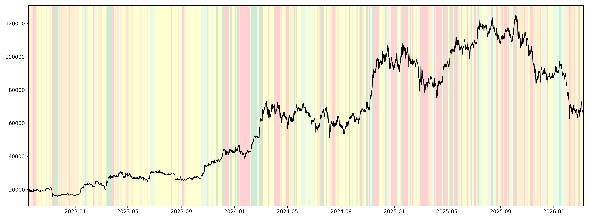
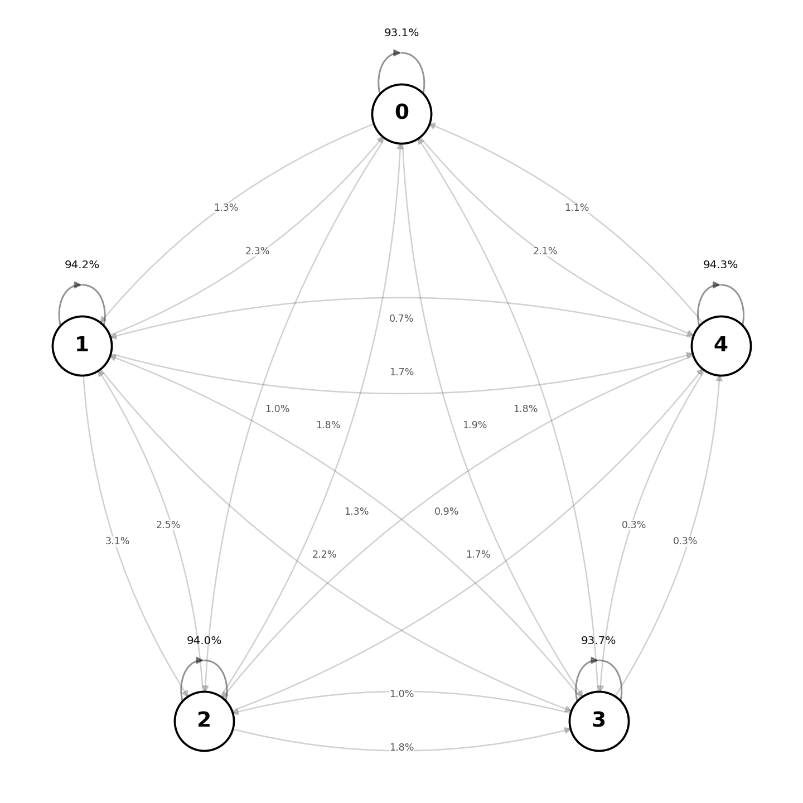
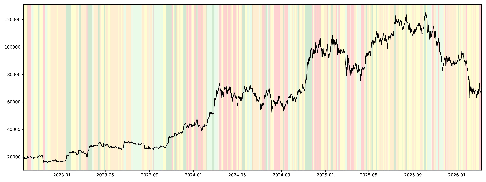
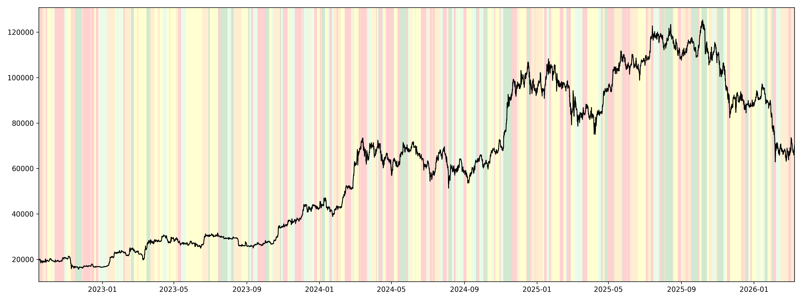

## Market Regimes for Bitcoin with GMM, HMM, and TCN-HMM

In the previous backtesting discussion, I mentioned that using a single model, even with a walk-forward validation scheme, can still be a weak idea. The relationship between features and the target may change over time.

For example, after the transition to electric vehicles, car prices may start depending more on rare-earth metals than before. In financial markets, the same idea appears naturally: the market can move through different regimes, and each regime may require its own model.

A natural formulation is therefore to identify market regimes first, and then either train a separate model for each regime or use a mixture of models weighted by the probabilities of those regimes.

In this mini-experiment, I tested regime detection for Bitcoin using 4-hour candles. The data was collected from the Bybit API and covers the period from 2020 to 2026.

The problem formulation depends on the final task. In my case, I assumed that there are regimes where Bitcoin is more likely to grow and regimes where it is more likely to fall. The next question is: which features can characterize these regimes?

I used the following group of features:

| Feature | Description |
|----------|----------|
| `r` | 4-hour log return |
| `roll_skew` | rolling skewness of returns |
| `ret_6` | cumulative return over 6 bars |
| `ret_24` | cumulative return over 24 bars |
| `rv_42` | realized volatility over 42 bars |
| `rv_72` | realized volatility over 72 bars |
| `rv_ratio_24_72` | ratio of short-term to medium-term realized volatility |
| `downside_share_72` | share of downside volatility in total volatility |
| `ma_dist_72` | log-price distance from its moving average |
| `ma_slope_42` | moving-average slope |
| `drawdown_180` | rolling drawdown |
| `ret_24_over_rv_72` | volatility-adjusted momentum |

These features were selected as variables that may characterize different market environments through momentum, volatility, downside pressure, and trend persistence. More implementation details can be found in `hmm.ipynb`.

To avoid leakage, I used a walk-forward setup with 3000 observations for training and 42 observations (7 days) for testing.

## Gaussian Mixture Model (GMM)

The first model I tested was a Gaussian Mixture Model.

The idea is to assume that observations are generated from a mixture of several Gaussian distributions:

  

where each Gaussian component corresponds to a market regime.

The main drawback of GMM is that it assumes observations are iid. In practice this means that regimes do not have persistence and there is no explicit mechanism describing transitions between states. For financial markets this assumption is rather naive.

I used 5 regimes. Green corresponds to the strongest bullish regime and red corresponds to the strongest bearish regime.

  

More implementation details can be found in `gmm.ipynb`.

## Hidden Markov Model (HMM)

The next model was a Hidden Markov Model.

Unlike GMM, HMM explicitly models regime persistence through a latent Markov chain.

The joint density of a multivariate Gaussian HMM is

  

where `d` is the number of features, `mu_k` is the mean vector of regime `k`, and `Sigma_k` is the corresponding covariance matrix.

  

The model parameters are estimated by maximizing the likelihood with respect to the initial state probabilities, transition matrix, and Gaussian emission parameters.

One useful byproduct of HMM is the transition probability matrix between regimes.

In my experiment the estimated transition structure looked as follows:

  

To avoid look-ahead bias I used filtered probabilities

  

instead of smoothed probabilities.

The resulting regime segmentation is shown below.

  

## TCN-HMM

Although HMM captures regime persistence, it can still struggle with nonlinear relationships.

One possible extension is to first learn nonlinear representations using a Temporal Convolutional Network (TCN) and then fit HMM on the latent factors produced by the network.

In some sense this becomes a simple Deep-HMM architecture.

  

More implementation details can be found in `tcn_hmm.ipynb`.

## Backtest

Having a visually appealing regime chart is not enough. We also need to verify whether these regimes contain economically useful information.

For each model I assigned the most probable regime

  

and generated positions using the previous bar's regime estimate:

  

Strategy returns were computed as

  

where transaction costs were fixed at

  

I tested five simple strategies:

- `long_4` – long only in the most bullish regime.
- `long_3_4` – long in regimes 3 and 4.
- `long_2_3_4` – long in regimes 2, 3 and 4.
- `weighted` – gradually increasing exposure.
- `long_short` – long bullish regimes and short bearish regimes.

The weighted strategy used

  

while the long-short strategy used

  

More implementation details can be found in `results.ipynb`.

## Results

### GMM

| strategy | mean_bar | ann_return | ann_vol | sharpe | max_dd |
|----------|-----------|-----------|----------|----------|----------|
| long_4 | 0.000035 | 0.079240 | 0.158155 | 0.482167 | -0.217606 |
| weighted | 0.000032 | 0.071444 | 0.191637 | 0.360095 | -0.351812 |
| long_3_4 | 0.000031 | 0.069533 | 0.241801 | 0.278007 | -0.419238 |
| long_2_3_4 | 0.000026 | 0.057908 | 0.334782 | 0.168149 | -0.535316 |
| long_short | -0.000038 | -0.079158 | 0.304425 | -0.270895 | -0.604885 |

### HMM

| strategy | mean_bar | ann_return | ann_vol | sharpe | max_dd |
|----------|-----------|-----------|----------|----------|----------|
| long_2_3_4 | 0.000228 | 0.645822 | 0.351665 | 1.416805 | -0.346502 |
| weighted | 0.000113 | 0.281130 | 0.209278 | 1.183797 | -0.191937 |
| long_3_4 | 0.000134 | 0.341064 | 0.259567 | 1.130585 | -0.251146 |
| long_short | 0.000160 | 0.418573 | 0.316246 | 1.105629 | -0.283197 |
| long_4 | 0.000045 | 0.104767 | 0.176808 | 0.563517 | -0.230953 |

### TCN-HMM

| strategy | mean_bar | ann_return | ann_vol | sharpe | max_dd |
|----------|-----------|-----------|----------|----------|----------|
| long_4 | 0.000057 | 0.133277 | 0.164028 | 0.762755 | -0.326104 |
| weighted | 0.000048 | 0.111808 | 0.195880 | 0.541081 | -0.325790 |
| long_2_3_4 | 0.000071 | 0.168134 | 0.340117 | 0.456925 | -0.426288 |
| long_3_4 | 0.000008 | 0.018483 | 0.241745 | 0.075760 | -0.381641 |
| long_short | -0.000043 | -0.089125 | 0.305984 | -0.305079 | -0.533052 |

## Conclusion

In this particular implementation, the classical HMM produced the strongest results. Even with extremely simple trading rules, the identified regimes contained meaningful predictive information.

However, there is still significant room for improvement.

First, the current formulation focuses on bullish and bearish market states. A more interesting approach may be to model volatility regimes instead. Different predictive models can then be trained on different subsets of the data. For example, boosting models may perform better during high-volatility periods, while simpler models such as logistic regression may be more stable during low-volatility periods.

Second, the trading rules used here are intentionally simple. No position sizing optimization, volatility targeting, or risk management was applied.

Finally, this idea is closely related to recent work on deep state-space and regime-switching models. One example is:

https://arxiv.org/pdf/2106.02329

which combines neural representations with latent regime dynamics in a unified framework.

All reported results were generated using walk-forward training and filtered state probabilities, ensuring that no future information was available at prediction time.
