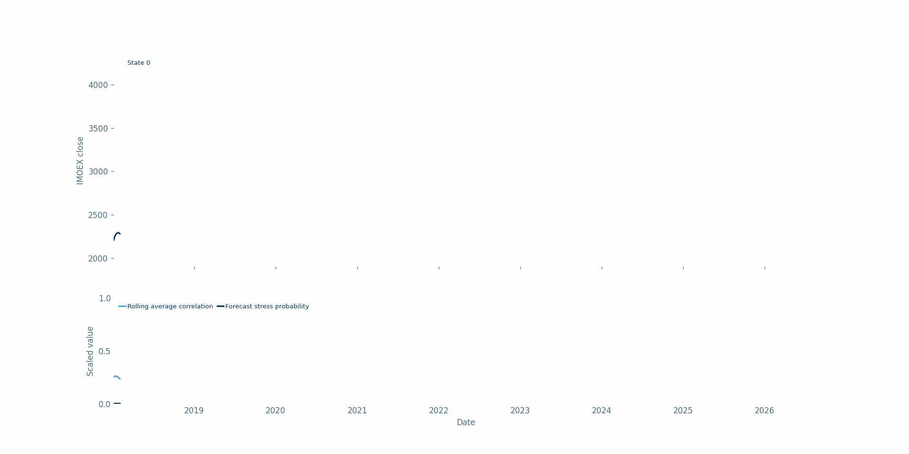
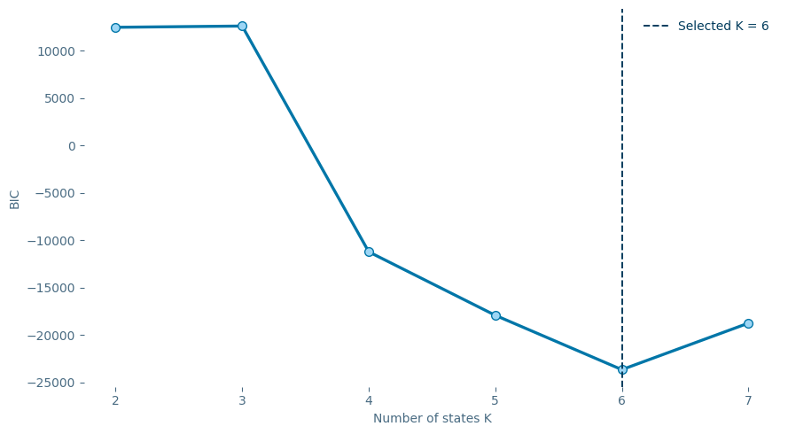
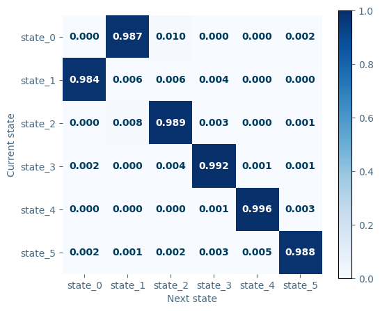
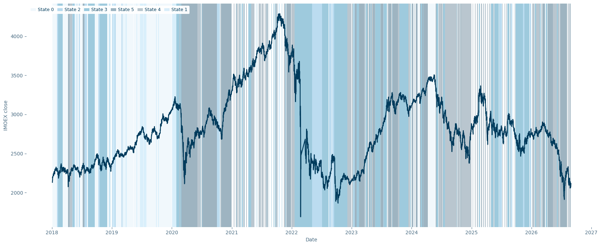
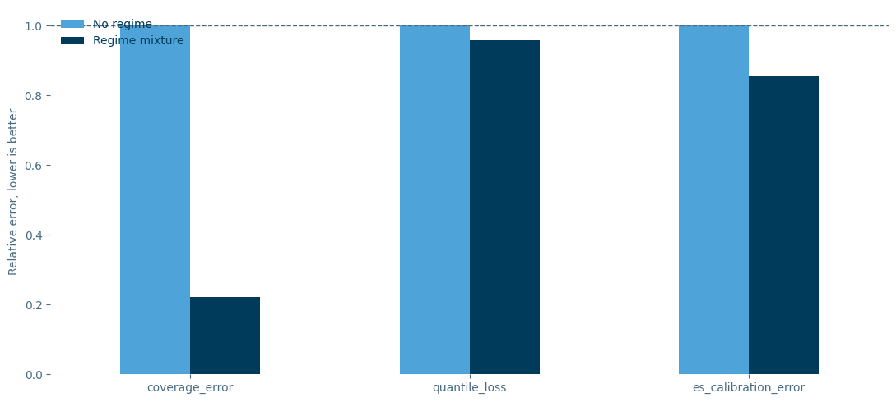
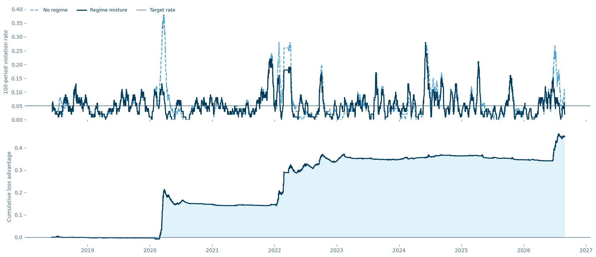

# Stress Regimes Detection

Markets can sometimes enter a stress regime, which may lead to negative financial results, increased risk, and reduced hedging capacity. This creates a natural problem: can we somehow identify in advance when the market is likely to enter a stress regime?

The idea presented below was partly inspired by this excellent video:

[https://youtu.be/VTlrVSJfvH4](https://youtu.be/VTlrVSJfvH4)

For this task, it is quite natural to use a Hidden Markov Model (HMM). In my case, however, I use **filtered probabilities**, which is important for a forecasting problem. I discuss this in more detail below.

Suppose we are working with some market, for example IMOEX. Intuitively, one might simply fit an HMM to the index returns. However, several important issues arise immediately.

If the index experiences a sharp move, it does not necessarily mean that the whole market is under stress. For example, a large company may receive a lawsuit or announce some unexpected event. Such a move can significantly affect the index, but from the perspective of the risk of a diversified portfolio, this event may not be particularly severe.

At the same time, during a real market-wide stress episode, assets usually start moving together: either many of them rise or many of them fall. In other words, correlations between asset returns increase.

The method is based exactly on this idea. I calculate a matrix of pairwise return correlations over a rolling window and then compute its determinant.

If the determinant is close to `1`, the correlation matrix is relatively close to the identity matrix, meaning that the assets are weakly related to each other. If the determinant is close to `0`, the matrix is close to singular, meaning that the assets are moving much more closely together.

For the dataset, I use only stocks that were constituents of the IMOEX index in 2012, which is the first available observation of the index composition. This also helps to reduce survivorship bias.

Details of data parsing and preprocessing can be found in `Parser.ipynb` and `dataset_creation.ipynb`.

Besides the determinant, I also use the first principal component from PCA, which should increase when the common dependence between stocks becomes stronger, as well as the average pairwise correlation.

So the HMM is fitted using three indicators related to cross-sectional market dependence: the determinant of the correlation matrix, the first PCA component, and the average correlation.

An important result is that the regimes differ not only in the variables used to fit the HMM, but also in the volatility of IMOEX, which is not used as an input feature. In the hourly model, IMOEX volatility is approximately `0.00269` in the lowest-correlation regime and approximately `0.00915` in the highest-correlation regime, i.e. about **3.4 times higher**.

This provides an additional economic interpretation of the detected states: the regime characterized by stronger cross-sectional dependence is also associated with substantially higher market risk. At the same time, a stress regime does not necessarily imply a negative expected return. Here, stress should rather be interpreted as a state of high systemic dependence and elevated risk, in which the benefits of diversification are reduced.

## Filtered State Probabilities

For this task I use **filtered probabilities**, rather than smoothed probabilities.

This is important because the problem is forecasting. At time `t`, the estimated state probabilities should depend only on information available up to time `t`.

The filtered probability can be written as

  

where `A` is the transition matrix and `p(y_t | S_t = j)` is the emission likelihood under state `j`.

The one-step-ahead state probability is then

  

In the implementation, Gaussian emission probabilities are computed using the state-specific mean vectors and covariance matrices. The posterior state probabilities are then updated recursively, and the filtered distribution is multiplied by the transition matrix to obtain the next-period state probabilities.

## Number of States

Another important issue is the choice of the number of HMM states.

A natural approach is to use BIC, but this is not always optimal in practice.

For example, at the hourly frequency, BIC suggests that the optimal model has six states.

However, if we look at the transition matrix, two of these states are effectively degenerate.

For this reason, I eventually use four regimes instead of six.

This is a useful example of why selecting the number of states purely according to BIC may not always be appropriate.

## Regime-Based VaR

As a measure of the quality of the regime model, I use VaR for IMOEX.

The regime-based VaR is constructed from historical returns, but observations receive different weights depending on their historical state probabilities and the forecast state probabilities for the next period.

For each historical observation, its weight combines the probability that the observation belonged to a particular state with the current forecast probability of that state. This produces a regime-dependent empirical return distribution.

VaR is then calculated as a weighted lower-tail quantile, while Expected Shortfall is calculated as the weighted average loss beyond this quantile.

The benchmark uses the same historical window but assigns equal weight to all observations.

The first panel compares realized losses, the standard historical VaR, and the regime-mixture VaR.

The second panel shows cumulative quantile loss. Lower cumulative quantile loss corresponds to better VaR forecasts.

The final panel compares three errors relative to the no-regime benchmark: coverage error, quantile loss, and ES tail calibration error. Each metric is divided by the corresponding benchmark value, so the no-regime model is equal to `1`. Values below `1` therefore mean that the regime model performs better.

Here, the ES tail calibration error is used as a diagnostic measure rather than as a formal ES backtest. It measures the difference between the average realized loss during VaR violations and the average predicted Expected Shortfall for the same observations.

## VaR Backtesting

The regime model can also be compared directly with a standard VaR benchmark.

The upper panel shows the rolling VaR violation rate for the no-regime and regime-mixture models together with the target violation rate.

The lower panel shows the cumulative difference

  

where `L` is the quantile loss.

A positive value means that the regime model has accumulated a lower quantile loss and therefore performs better than the benchmark. A negative value means that the no-regime VaR performs better.

I also use standard VaR backtesting diagnostics: the Kupiec test for unconditional coverage, an independence test for clustering of violations, and the joint conditional coverage test.

At the hourly frequency, the regime-based VaR performs substantially better than the no-regime benchmark. It improves the coverage error, quantile loss, and ES tail calibration error. In addition, the no-regime VaR fails the Kupiec unconditional coverage test at the 5% level, while the regime-mixture VaR passes it.

However, the independence test is rejected for both models. Therefore, although the regime-mixture approach substantially improves VaR calibration, it does not completely eliminate the clustering of VaR violations.

## Limitations

At the weekly frequency, the regime-based VaR performs worse than the no-regime benchmark, while at the other tested horizons the regime approach performs better. This may indicate that the model specification, including the choice of rolling windows, is less appropriate at the weekly frequency.

It is also useful to compare the proposed model with a simpler HMM fitted directly to IMOEX returns. The proposed cross-sectional model achieves a lower coverage error, meaning that its VaR violation rate is closer to the target level. However, in terms of quantile loss, the IMOEX-return HMM performs slightly better. Thus, the cross-sectional regime specification does not dominate the simpler alternative across all risk-forecasting metrics.

Finally, the number of states selected by BIC is not always practically optimal. At the hourly frequency, BIC favors six states, but two of them are effectively degenerate, so four regimes are used instead.

## Conclusion

Overall, this approach can be useful for detecting market stress regimes.

The main idea is not to define stress only through large index returns, but through an increase in dependence between individual assets. During real market-wide stress, correlations tend to increase, the correlation matrix becomes closer to singular, the first PCA component becomes more dominant, and the average pairwise correlation rises.

Importantly, the regimes identified from cross-sectional dependence also correspond to very different levels of IMOEX volatility, despite IMOEX returns not being used as an HMM input. This suggests that the detected regimes have an economically meaningful relationship with market risk rather than simply representing different values of the features used to construct them.

The results show that this regime information can improve risk estimation at some frequencies, especially at the hourly frequency. At the weekly frequency, however, there is no clear advantage.

So, in general, the approach may be useful, but there are several important details and limitations that should be kept in mind.

