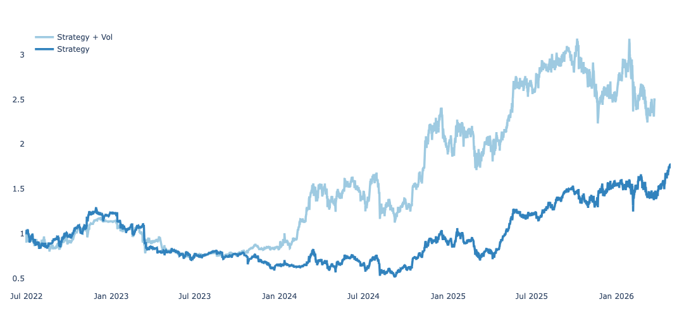
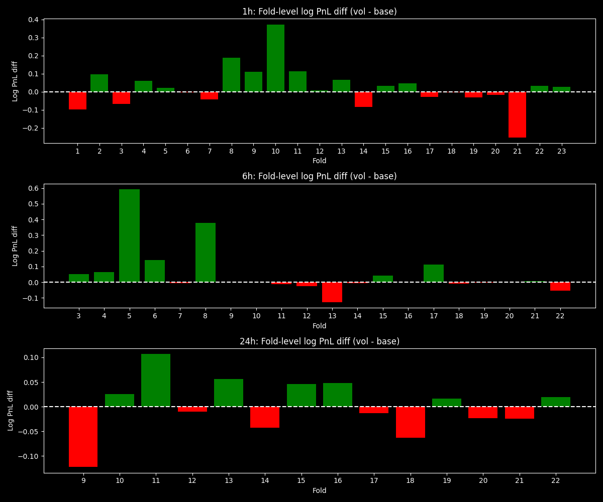

# Volatility-Adjusted Thresholds: A BTC Experiment


## Overview

In previous experiments, I studied which models are better at forecasting realized volatility (RV). On short and medium horizons, CatBoost showed the best predictive quality.

In this mini-research, I test whether incorporating volatility forecasts into the trading rule can improve strategy profitability.

The analysis is still focused on BTC and three forecast horizons:

- 1 hour
- 6 hours
- 24 hours

# Key Findings

- BTC data from 2020–2026 was collected via the ByBit API.
- Volatility-adjusted thresholds improve raw cumulative PnL on 1h and 6h horizons.
- However, the improvement is not statistically robust after accounting for market exposure.
- Return decomposition shows that most gains come from increased directional BTC beta rather than standalone predictive alpha.
- Newey-West HAC tests fail to show statistically significant alpha contributions from the volatility component.


## Motivation

The first idea was to forecast not raw log returns, but normalized returns:

<p align="center">
  
</p>

However, I quickly abandoned this approach. In that setup, the target itself contains a forecasted / estimated quantity, which creates measurement error in the dependent variable. This would likely make the coefficients inconsistent due to endogeneity.

Therefore, the rest of the research focuses on a different approach:

1. forecast the sign of the future return;
2. use volatility forecasts only inside the trading rule for entry and exit thresholds.

The base forecasting model predicts the sign of BTC returns rather than the expected return itself. This is intentional: on high-frequency timeframes, \(E[r_t]\) is approximately zero, so predicting the return level directly is very difficult. Sign prediction provides at least some potential edge.

The sign of the return is predicted using logistic regression with a walk-forward procedure and no leakage. Details are available in:

```text
logreg.ipynb
```

After obtaining predicted probabilities for the return sign, long / short / flat thresholds are selected using another walk-forward procedure, again without leakage.

Details of threshold tuning, volatility normalization, and strategy construction are available in:

```text
strategies comparison.ipynb
```
## Limitations

Several important limitations remain:

- transaction costs and execution slippage are simplified;
- the sample period is dominated by a long-term bullish BTC regime;
- model stability outside crypto is unknown;
- results are based on a single asset and limited horizons.
  
## Strategies Compared

Two strategies are compared.

### 1. Baseline threshold strategy

The first strategy uses only predicted sign probabilities:

<p align="center">
  &space;threshold_{long}&space;\Rightarrow&space;long" />
</p>

<p align="center">
  
</p>

otherwise the strategy stays flat.

### 2. Volatility-adjusted threshold strategy

The second strategy uses predicted volatility to adjust the entry and exit thresholds.

The intuition is that this can be interpreted similarly to:

<p align="center">
  
</p>

In other words, the signal is evaluated relative to predicted volatility. From an information-theoretic perspective, when volatility is high, the same directional probability forecast may contain less useful information. When volatility is low, the same probability forecast may be more informative.

## Initial Performance Results

At first glance, the volatility-adjusted strategy looks much better.

### 1h Horizon

| Strategy | PnL | SR | Calmar | Sortino | MaxDD |
|---|---:|---:|---:|---:|---:|
| With Vol | 1.510033 | 0.550054 | 0.701779 | 0.580551 | -0.397589 |
| No Vol | 0.777042 | 0.356664 | 0.268128 | 0.363591 | -0.603128 |



### 6h Horizon

| Strategy | PnL | SR | Calmar | Sortino | MaxDD |
|---|---:|---:|---:|---:|---:|
| With Vol | 2.155693 | 0.775548 | 0.813362 | 0.975426 | -0.506443 |
| No Vol | 0.183339 | 0.105939 | 0.087101 | 0.123704 | -0.539113 |

The raw cumulative PnL improvement looks impressive. However, the statistical tests do not confirm a statistically significant difference between strategy returns.

## HAC Test for Mean Return Difference

The tested null hypothesis is:

<p align="center">
  
</p>

Equivalently:

<p align="center">
  
</p>


The test is estimated using Newey-West / HAC standard errors.

| Horizon | n | mean_log_pnl_diff | total_log_pnl_diff | simple_total_diff | t_stat | p_value | maxlags |
|---|---:|---:|---:|---:|---:|---:|---:|
| 1h | 32759 | 0.000017 | 0.543760 | 0.722471 | 0.859058 | 0.390309 | 14 |
| 6h | 4864 | 0.000236 | 1.148256 | 2.152690 | 1.853863 | 0.063759 | 9 |
| 24h | 809 | 0.000021 | 0.016805 | 0.016947 | 0.044919 | 0.964172 | 6 |

The 6h horizon is the closest to significance, but it still does not pass the 5% level. The 1h and 24h horizons are not statistically significant.

## Fold-Level PnL Differences

When decomposing the PnL difference by walk-forward folds, both positive and negative folds are observed. Some folds show stable improvement from the volatility-adjusted strategy, while others show worse performance.



This suggests that the cumulative PnL difference is not uniformly distributed across all folds.

The Sharpe ratio comparison using block bootstrap also does not show a statistically robust difference.

## Exposure Analysis

The next step is to check whether the volatility adjustment improves forecasting quality or simply changes the trading policy.

The exposure statistics show a clear shift.

| Strategy | mean_signal | gross_exposure | long_share | short_share | flat_share |
|---|---:|---:|---:|---:|---:|
| 1h_base | 0.139702 | 0.730000 | 0.434851 | 0.295149 | 0.270000 |
| 1h_vol | 0.469550 | 0.773894 | 0.621722 | 0.152172 | 0.226106 |
| 6h_base | 0.501307 | 0.797423 | 0.649365 | 0.148058 | 0.202577 |
| 6h_vol | 0.886924 | 0.901316 | 0.894120 | 0.007196 | 0.098684 |
| 24h_base | 0.711510 | 0.847534 | 0.779522 | 0.068012 | 0.152466 |
| 24h_vol | 0.648949 | 1.000000 | 0.824475 | 0.175525 | 0.000000 |

The most important observation is the 6h horizon:

- baseline short share: 14.8%;
- volatility-adjusted short share: 0.7%;
- volatility-adjusted strategy is almost always long.

This already suggests that the volatility adjustment may have introduced a strong directional bias.

## Transition-Level PnL Attribution

The transition analysis compares how signals change when moving from the baseline strategy to the volatility-adjusted strategy.

A transition such as:

```text
-1 -> 1
```

means that the baseline strategy was short, while the volatility-adjusted strategy was long.

### 1h Horizon

| transition | n | pnl_diff | mean_diff | avg_market_ret | share_obs | share_total_pnl_diff |
|---|---:|---:|---:|---:|---:|---:|
| 0 -> 1 | 4992 | 0.392891 | 0.000079 | 0.000079 | 0.152386 | 0.722544 |
| -1 -> 0 | 3402 | 0.157341 | 0.000046 | 0.000046 | 0.103849 | 0.289358 |
| 1 -> -1 | 382 | 0.085431 | 0.000224 | -0.000112 | 0.011661 | 0.157112 |
| 1 -> 0 | 142 | 0.039984 | 0.000282 | -0.000282 | 0.004335 | 0.073532 |
| -1 -> -1 | 4507 | 0.000000 | 0.000000 | 0.000006 | 0.137581 | 0.000000 |
| 0 -> 0 | 3863 | 0.000000 | 0.000000 | 0.000050 | 0.117922 | 0.000000 |
| 1 -> 1 | 13725 | 0.000000 | 0.000000 | 0.000042 | 0.418969 | 0.000000 |
| 0 -> -1 | 96 | -0.012686 | -0.000132 | 0.000132 | 0.002930 | -0.023330 |
| -1 -> 1 | 1650 | -0.119201 | -0.000072 | -0.000036 | 0.050368 | -0.219217 |

### 6h Horizon

| transition | n | pnl_diff | mean_diff | avg_market_ret | share_obs | share_total_pnl_diff |
|---|---:|---:|---:|---:|---:|---:|
| -1 -> 1 | 199 | 0.763003 | 0.003834 | 0.001917 | 0.040913 | 0.664489 |
| 0 -> 1 | 689 | 0.306045 | 0.000444 | 0.000444 | 0.141653 | 0.266530 |
| -1 -> 0 | 382 | 0.114890 | 0.000301 | 0.000301 | 0.078536 | 0.100056 |
| 0 -> 0 | 98 | 0.000000 | 0.000000 | 0.000946 | 0.020148 | 0.000000 |
| 1 -> 1 | 3461 | 0.000000 | 0.000000 | 0.000143 | 0.711554 | 0.000000 |
| 1 -> -1 | 17 | -0.003511 | -0.000207 | 0.000103 | 0.003495 | -0.003057 |
| 0 -> -1 | 18 | -0.032172 | -0.001787 | 0.001787 | 0.003701 | -0.028018 |

### 24h Horizon

| transition | n | pnl_diff | mean_diff | avg_market_ret | share_obs | share_total_pnl_diff |
|---|---:|---:|---:|---:|---:|---:|
| 1 -> -1 | 51 | 0.066958 | 0.001313 | -0.000656 | 0.063041 | 3.984310 |
| -1 -> 1 | 1 | 0.021132 | 0.021132 | 0.010566 | 0.001236 | 1.257443 |
| -1 -> -1 | 30 | 0.000000 | 0.000000 | -0.005296 | 0.037083 | 0.000000 |
| 1 -> 1 | 651 | 0.000000 | 0.000000 | 0.001074 | 0.804697 | 0.000000 |
| 0 -> -1 | 61 | -0.018525 | -0.000304 | 0.000304 | 0.075402 | -1.102303 |
| 0 -> 1 | 15 | -0.052760 | -0.003517 | -0.003517 | 0.018541 | -3.139450 |

The transition tables show that the improvement mostly comes from changed signals, especially from:

```text
-1 -> 1
-1 -> 0
0 -> 1
```

In other words, the volatility adjustment often removes shorts or turns them into longs.

## Beta Decomposition

To check whether the PnL difference is explained by market exposure, I estimate the following specification:

<p align="center">
  
</p>

where:

<p align="center">
  
</p>

<p>
and <code>r_t^mkt</code> is the BTC forward log return.
</p>

HAC standard errors are used.

### Beta Decomposition Results

| Horizon | alpha | alpha_pvalue | beta_to_market | beta_pvalue | R-squared |
|---|---:|---:|---:|---:|---:|
| 1h | 0.000006 | 0.745161 | 0.293971 | 1.808002e-80 | 0.191 |
| 6h | 0.000149 | 0.153490 | 0.297670 | 1.045806e-11 | 0.206 |
| 24h | 0.000100 | 0.817037 | -0.133413 | 2.596418e-03 | 0.070 |

The intercept is not statistically significant on any horizon. However, the market beta is statistically significant.

This means that the difference between the volatility-adjusted strategy and the baseline strategy is mostly explained by changed BTC market exposure, not by statistically significant standalone alpha.

---

## Beta-Neutral Difference

To determine whether the volatility-adjusted strategy generates standalone alpha or simply increases market exposure, I regress the return difference between the two strategies on forward BTC returns:

<p align="center">
  
</p>

where:

<p>
<code>d_t</code> is the return difference between the volatility-adjusted and baseline strategies,<br>
<code>r_t^mkt</code> is the forward BTC return,<br>
<code>epsilon_t</code> is the beta-neutral residual component.
</p>


Newey-West HAC standard errors are used to account for serial correlation and heteroskedasticity.

| Horizon | raw_total_diff | alpha | beta_to_market | alpha_pvalue | beta_pvalue |
|---|---:|---:|---:|---:|---:|
| 1h | 0.543760 | 0.000006 | 0.293971 | 0.745161 | 1.81e-80 |
| 6h | 1.148256 | 0.000149 | 0.297670 | 0.153490 | 1.05e-11 |
| 24h | 0.016805 | 0.000100 | -0.133413 | 0.817037 | 2.60e-03 |

The results show that:

- the intercept (alpha) is statistically insignificant across all horizons,
- the differential return is strongly explained by market beta exposure,
- the volatility-adjusted strategy mainly alters directional exposure rather than generating independent alpha.

This suggests that most of the apparent improvement comes from changing effective BTC exposure rather than from volatility forecasting itself.

## Interpretation

The volatility-adjusted strategy initially looks much better in cumulative PnL and risk metrics. However, after decomposing the source of the improvement, the conclusion is more cautious.

The volatility adjustment does not appear to add statistically significant standalone alpha.

Instead, it changes the trading rule in a way that introduces a directional bias:

- fewer shorts;
- more long exposure;
- higher market beta, especially on the 1h and 6h horizons.

On a bullish BTC sample, this makes the volatility-adjusted strategy look very successful. But this does not necessarily mean that volatility forecasts improved the strategy in a robust way.


## Conclusion

Adding volatility to the threshold rule improves cumulative PnL visually, especially on the 1h and 6h horizons.

However:

- HAC tests do not show statistically significant mean return differences at the 5% level;
- block bootstrap Sharpe tests also do not show a robust difference;
- fold-level results are mixed;
- exposure analysis shows a strong shift toward long positions;
- beta decomposition shows that the strategy difference is mostly explained by market exposure;
- beta-neutral cumulative improvement disappears.

Therefore, the current evidence does not support the claim that volatility forecasts create standalone trading alpha.

The more likely explanation is that volatility-adjusted thresholds introduced a directional bias that worked well in a bullish BTC market.

This is still an ongoing research direction. I plan to revisit the topic later with a more detailed investigation of volatility forecasting, regime dependence, and exposure-adjusted performance attribution.
