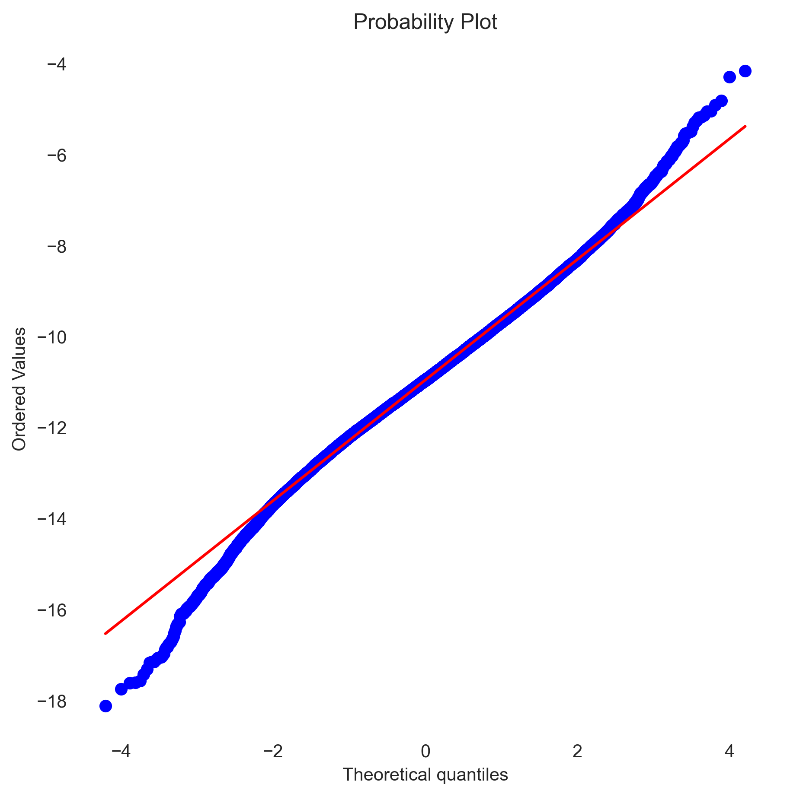
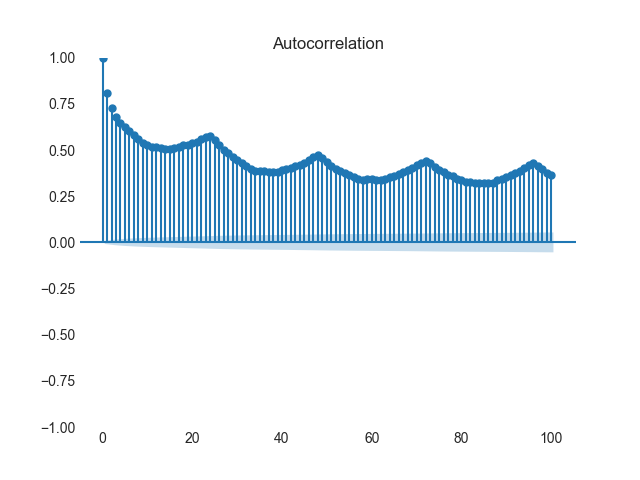
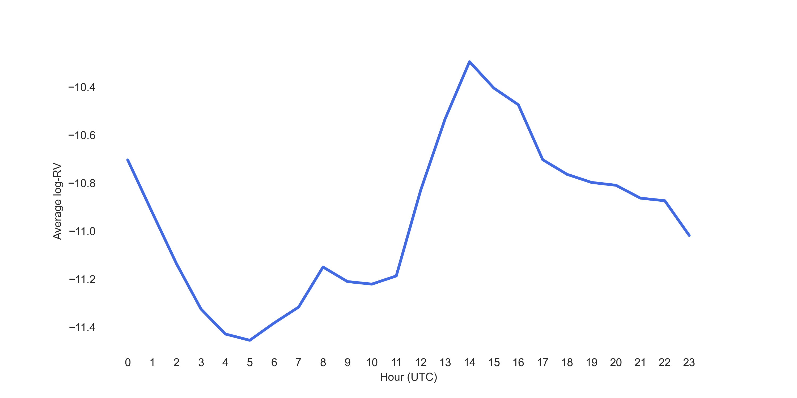
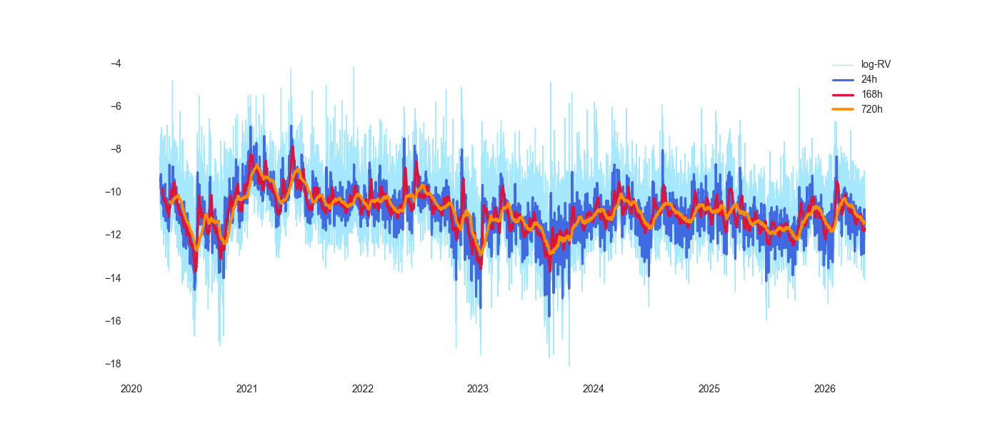
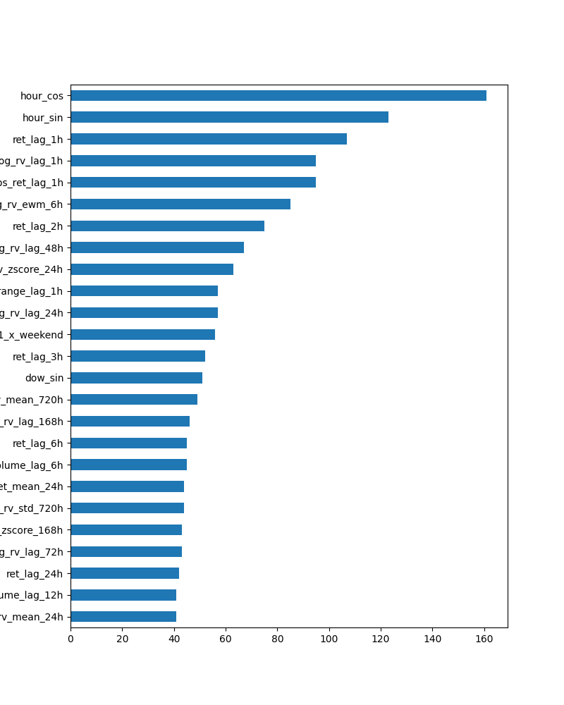
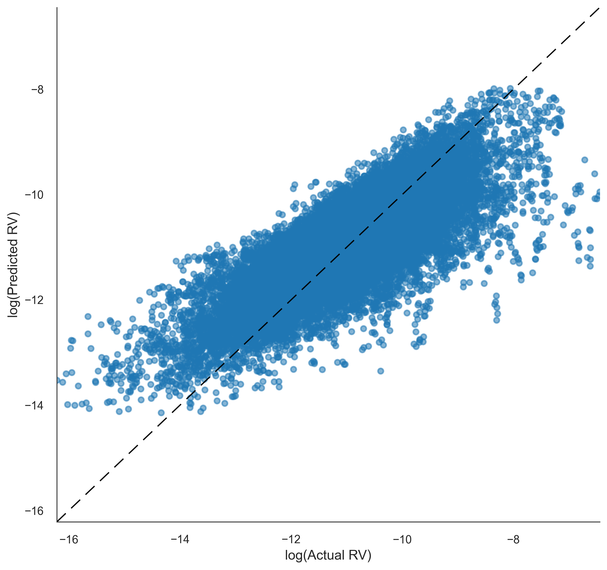
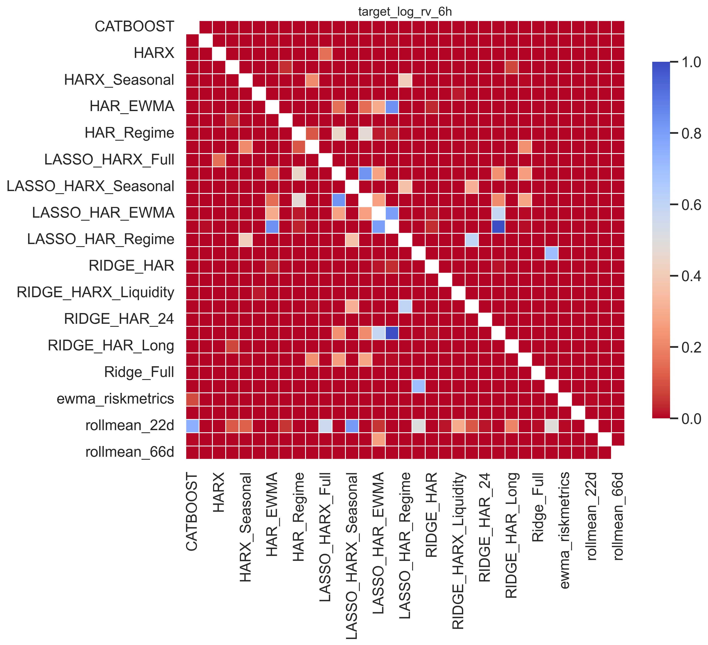
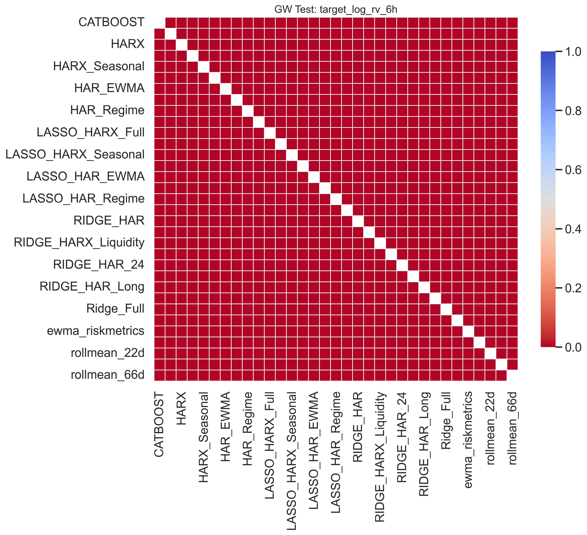
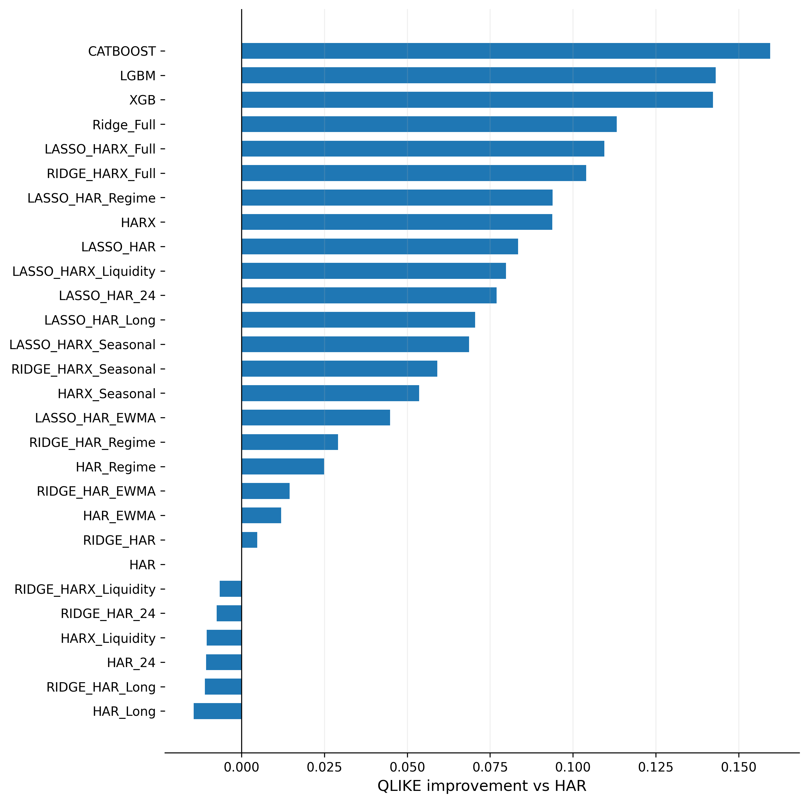

# Introduction

This project compares a range of econometric and machine learning approaches for forecasting Bitcoin realized volatility. Accurate volatility forecasts are important for systematic trading since volatility directly affects position sizing, leverage allocation, volatility targeting, and overall risk management. Improvements in volatility estimation can therefore materially influence the stability and risk-adjusted performance of trading strategies.

The forecasting target is logarithmic realized volatility:

<p align="center">
log(RV<sub>t</sub>)
</p>

where realized volatility is computed from minute-level returns:

<p align="center">
RV<sub>t</sub> = Σ r<sub>t,i</sub><sup>2</sup>
</p>

with intraminute returns defined as:

<p align="center">
r<sub>t,i</sub> = log(P<sub>t,i</sub>) − log(P<sub>t,i−1</sub>)
</p>

Minute-frequency returns were used intentionally since realized variance converges to the latent quadratic variation process as the sampling frequency increases. In practice, this provides a substantially more accurate volatility proxy than lower-frequency estimators based on hourly or daily returns.

The empirical analysis is conducted on Bitcoin data from 2020 to 2026. Bitcoin provides an especially interesting setting for volatility forecasting due to its 24/7 trading structure, pronounced regime shifts, strong volatility clustering, and persistent intraday seasonality.

The study considers multiple forecasting horizons, including 1h, 6h, 24h, and 168h ahead realized volatility prediction. All models are evaluated on identical targets, feature sets, and rolling splits to ensure a fair comparison between econometric and ML approaches. All horizons are modeled directly rather than recursively iterated from shorter-horizon forecasts.

To avoid look-ahead bias and leakage, all experiments are performed under a strict walk-forward framework. For models requiring hyperparameter tuning, each rolling iteration uses a two-year training window, a one-month validation window, and a one-month test window. For models without validation, the setup uses two years plus one month for training and one month for testing. All predictions are therefore fully out-of-sample and generated only from historically available information. Feature standardization, rolling statistics, normalization procedures, and all other feature transformations were computed sequentially within each walk-forward iteration using only historically available data.

Model performance is evaluated using MSE, MAE, and QLIKE loss functions together with Diebold-Mariano and SPA-like statistical comparison procedures.

Classical GARCH-family models are intentionally excluded from the main comparison since the forecasting target is realized volatility rather than latent conditional variance inferred from daily return innovations.

# Main Findings

- Boosting models dominate short-horizon volatility forecasting.
- HAR-type models become increasingly competitive at longer horizons.
- Intraday seasonality is one of the strongest predictors of BTC volatility.
- Volatility forecasting performance is highly regime-dependent.
- Simple persistence and rolling-average baselines are consistently dominated.
  
# Exploratory Data Analysis (EDA)

## Distributional Properties

After logarithmic transformation, hourly realized volatility (`log-RV`) becomes substantially more stable and visually close to Gaussian. However, the QQ-plot still reveals moderately heavier tails than the normal distribution, suggesting that heavy-tailed distributions such as Student-t, skewed Student-t, or GED may be more appropriate for probabilistic volatility modeling.

The empirical moments also indicate that the log transformation significantly stabilizes the distribution relative to raw realized volatility.

For `log-RV`:
- Skewness ≈ -0.08
- Excess Kurtosis ≈ 0.72

For raw realized volatility (`RV`):
- Skewness ≈ 39.60
- Excess Kurtosis ≈ 2709.81

This highlights the extreme heavy-tail behavior of raw RV and further justifies the logarithmic transformation for ML modeling. 



---

## Autocorrelation and Seasonality

The ACF and decay-ACF structures exhibit:
- strong persistence,
- slow autocorrelation decay,
- clear seasonal spikes at multiples of 24 hours.

This suggests pronounced intraday seasonality in volatility dynamics, likely associated with:
- trading session overlaps,
- liquidity cycles,
- macroeconomic announcement windows.

These findings motivate the inclusion of:
- hour-of-day and day-of-week features,
- cyclical (`sin/cos`) encodings,
- lagged volatility components at 24h / 48h / 72h / 168h horizons.



---

## Stationarity and Regime Dynamics

ADF rejects the unit-root hypothesis, while KPSS rejects strict stationarity around a constant mean. This is consistent with a volatility process that is stationary in a broad sense, but affected by persistence, deterministic seasonal structure, and regime-dependent dynamics. In addition, CUSUM diagnostics strongly reject parameter stability over time, providing statistical evidence of structural instability and changing volatility regimes across different market periods.

BTC volatility exhibits a clear deterministic seasonal structure rather than purely random fluctuations. Volatility is lowest during low-activity Asian trading hours and increases significantly during the US trading session and the EU–US overlap window, where global liquidity, institutional participation, and macroeconomic activity are highest.



Weekly seasonality also indicates lower volatility during weekends, likely due to reduced participation from traditional financial institutions and lower overall market activity.

These results suggest that volatility dynamics are closely tied to global market structure and trading activity. Consequently, ML models should incorporate time-aware and regime-aware features such as:
- hour-of-day,
- day-of-week,
- weekend indicators,
- trading-session dummies,
- cyclical `sin/cos` encodings,
- lagged volatility features at 24h / 48h / 72h / 168h horizons.

Since the volatility process exhibits regime dependence and structural instability, rolling and exponentially-weighted features may also help models adapt to changing market conditions and partially mitigate distribution shift across different volatility regimes.
  
---

## Volatility Clustering and Serial Dependence

ARCH-LM and Ljung-Box diagnostics strongly reject the absence of autocorrelation and conditional heteroskedasticity.

This confirms that:
- past volatility contains predictive information about future volatility,
- the process is far from white noise,
- autoregressive volatility modeling is statistically justified.

---

## Heavy Tails and Long Memory

Hill estimator diagnostics indicate heavier-than-Gaussian tails even after log transformation, although the tail behavior becomes substantially more stable relative to raw RV.

In addition, GPH diagnostics suggest fractional integration and long-memory dynamics (`d ≈ 0.31`), motivating:
- HAR-RV structures,
- FIGARCH-style dynamics,
- long-memory ML architectures.

The estimated Hurst exponent appears unstable and inconsistent with the observed ACF persistence, likely due to structural breaks and intraday seasonality. Consequently, greater emphasis is placed on ACF/GPH diagnostics.



# Feature Engineering

The feature engineering pipeline was designed directly from the empirical findings of the EDA. Since realized volatility exhibits strong persistence, intraday seasonality, long-memory dynamics, and regime dependence, the final feature set combines autoregressive, statistical, microstructure, temporal, and regime-aware components.

The raw minute-level OHLCV data were first aggregated into hourly intervals. Hourly realized volatility (`RV`) was computed as the sum of squared intraminute log-returns and subsequently transformed using <code>log(RV<sub>t</sub>)</code>. The logarithmic transformation substantially stabilizes the distribution and mitigates the extreme heavy-tail behavior observed in raw volatility.

The resulting feature space includes lagged volatility terms across multiple horizons (`1h`–`168h`), rolling and exponentially weighted statistics, rolling z-score normalization features, lagged returns and absolute returns, intrabar range-based measures (`high-low` and `open-close` ranges), as well as volume, turnover, and dollar-volume dynamics.

Feature importance analysis using LightGBM provides an additional nonlinear check of the feature design. The two most important predictors are `hour_cos` and `hour_sin`, indicating that deterministic intraday seasonality is one of the dominant drivers of BTC volatility dynamics.



This result is highly consistent with the elevated volatility observed during the US session and the EU–US overlap period in the EDA. Accordingly, the feature set includes cyclical temporal encodings and trading-session indicators that capture hour-of-day effects, day-of-week effects, weekend dynamics, and the distinct behavior of Asian, European, and US trading sessions.

The lag structure and rolling windows were selected to reflect the strong persistence and long-memory behavior identified in the ACF and GPH diagnostics. To partially account for the structural instability revealed by the CUSUM diagnostics, the feature set also incorporates rolling and exponentially weighted statistics together with regime indicators based on rolling volatility quantiles.

# Models Comparison

Model performance is evaluated using MSE, MAE, Pearson correlation, and QLIKE loss functions together with Diebold-Mariano, Giacomini-White, and SPA-style statistical comparison procedures. This transition is highly consistent with the long-memory and seasonal structure identified in the EDA.

## 1h Ahead Forecasting

| Model | QLIKE | MSE | Pearson |
|---|---:|---:|---:|
| CATBOOST | 0.516 | 0.578 | 0.742 |
| LGBM | 0.528 | 0.580 | 0.740 |
| XGB | 0.532 | 0.583 | 0.737 |
| Ridge_Full | 0.567 | 0.594 | 0.724 |
| HARX | 0.570 | 0.603 | 0.696 |

At the 1h horizon, boosting models achieve the best overall performance across all major metrics. The results suggest that short-term volatility dynamics are highly nonlinear and benefit from flexible interaction modeling. Classical HAR-type models remain competitive but consistently underperform tree-based ML approaches.

---

## 6h Ahead Forecasting

| Model | QLIKE | MSE | Pearson |
|---|---:|---:|---:|
| CATBOOST | 0.330 | 0.470 | 0.746 |
| LGBM | 0.342 | 0.481 | 0.743 |
| XGB | 0.343 | 0.476 | 0.740 |
| Ridge_Full | 0.364 | 0.465 | 0.727 |
| HARX | 0.376 | 0.477 | 0.692 |

At intermediate intraday horizons, ML models continue to dominate both QLIKE and correlation-based metrics. Linear ridge-based models become more competitive in MSE terms, suggesting that medium-horizon volatility contains a stronger low-frequency component captured well by regularized linear structures.

The scatterplot below illustrates the relationship between predicted and realized volatility for the CATBOOST model at the 6h horizon. Despite the substantial noise inherent in volatility forecasting, the model captures the overall volatility structure reasonably well, particularly during elevated volatility periods.




---

## 24h Ahead Forecasting

| Model | QLIKE | MSE | Pearson |
|---|---:|---:|---:|
| CATBOOST | 0.269 | 0.423 | 0.680 |
| LGBM | 0.284 | 0.442 | 0.666 |
| XGB | 0.286 | 0.443 | 0.654 |
| HARX | 0.292 | 0.403 | 0.597 |
| Ridge_Full | 0.294 | 0.402 | 0.650 |

At the daily horizon, the performance gap between ML and econometric-style models narrows substantially. While boosting models still achieve the best QLIKE values, HAR/HARX-type structures become highly competitive in MSE terms, indicating that persistent autoregressive structure becomes increasingly important at lower frequencies.

---

## 168h Ahead Forecasting

| Model | QLIKE | MSE | Pearson |
|---|---:|---:|---:|
| RIDGE_HARX_Seasonal | 0.202 | 0.333 | 0.318 |
| RIDGE_HAR_Regime | 0.205 | 0.339 | 0.295 |
| RIDGE_HAR_EWMA | 0.206 | 0.338 | 0.293 |
| RIDGE_HAR_24 | 0.206 | 0.341 | 0.296 |
| RIDGE_HARX_Liquidity | 0.210 | 0.348 | 0.291 |

At the weekly horizon, regularized HAR-type models clearly outperform boosting methods. The results suggest that long-horizon volatility forecasting is driven primarily by persistent low-frequency structure, seasonality, and regime information rather than short-term nonlinear interactions. Tree-based models appear to overfit short-horizon dynamics and lose predictive power as the forecast horizon increases.


---

Overall, the results reveal a clear horizon-dependent transition in model behavior. Flexible ML models perform best for short-horizon forecasting where local nonlinearities dominate, while regularized HAR-style structures become increasingly effective at longer horizons due to their ability to capture persistence, long memory, and deterministic seasonal structure. Naive persistence and rolling-average baselines are consistently dominated across all horizons, confirming that the volatility process contains substantial predictable structure.

However, aggregate performance metrics alone do not provide a complete picture of model behavior across different market conditions. Forecasting performance varies substantially across volatility regimes. During high-volatility periods, boosting models often achieve superior performance due to their ability to capture nonlinear interactions and rapidly changing market dynamics. In contrast, during relatively stable low-volatility regimes, simpler HAR-type structures frequently become more competitive since persistent autoregressive dynamics dominate volatility evolution.

To investigate this regime dependence more explicitly, all metrics were additionally evaluated separately across realized volatility quantiles. The quantile-based analysis reveals a clear conditional structure in model performance. HAR and ridge-based HAR specifications tend to perform well in lower-volatility regimes, where volatility dynamics are smoother and more persistent. Conversely, tree-based ML models become increasingly competitive in upper volatility quantiles, where nonlinearities, regime shifts, and abrupt volatility transitions become more important.

This result further supports the conclusion that no single modeling framework dominates uniformly across all market environments. Instead, the relative advantage of econometric versus ML approaches depends strongly on the underlying volatility regime and forecast horizon.

## Statistical Comparison of Forecasts

The Diebold-Mariano and Giacomini-White tests indicate that forecast differences between most models are statistically significant across multiple horizons.

The Diebold-Mariano heatmap for the 6h horizon:



together with the Giacomini-White heatmap:



shows that the majority of pairwise model comparisons reject equal predictive accuracy. This suggests that the observed differences in forecasting performance are unlikely to be entirely driven by random variation.

The Diebold-Mariano test evaluates whether two forecasting models have equal average predictive loss over the full sample. However, the standard DM framework assumes relatively stable forecast comparison dynamics over time and does not explicitly account for possible state dependence or conditional instability in forecast performance.

The Giacomini-White test extends this framework by evaluating conditional predictive ability. In practice, GW is more robust in settings with structural instability, time-varying forecast performance, and regime dependence, all of which are highly relevant for cryptocurrency volatility forecasting. Since BTC volatility exhibits strong nonstationarity, regime shifts, and changing market microstructure across time, the GW framework is particularly informative in this setting.

Importantly, both tests lead to broadly consistent conclusions, strengthening the evidence that the observed forecast differences are economically and statistically meaningful.

However, pairwise testing alone is insufficient in large model comparison settings since repeated testing may produce spurious discoveries due to data-snooping effects and multiple-comparison bias. To address this issue, an SPA-like procedure was additionally performed using the HAR model as the benchmark specification.

The SPA-style test evaluates whether competing models achieve statistically meaningful improvements in QLIKE loss relative to the benchmark after accounting for the multiplicity of model comparisons.

The resulting comparison for the 6h horizon is shown below:



The results indicate that many ML and extended HAR-type specifications consistently outperform the baseline HAR model across several horizons. This suggests that incorporating additional nonlinear, seasonal, liquidity, and regime-aware features materially improves realized volatility forecasts.

From a practical perspective, better volatility forecasts may directly improve volatility targeting, leverage allocation, and position scaling procedures, potentially leading to more stable risk-adjusted strategy PnL.

# Repository Structure

```text
├── readme.md
│
├── notebooks/
│   ├── EDA.ipynb
│   ├── target_creation.ipynb
│   ├── feature_engineering.ipynb
│   ├── forecasts_comparison.ipynb
│   │
│   ├── HAR.ipynb
│   ├── lasso_ridge_HAR.ipynb
│   ├── ridge.ipynb
│   │
│   ├── CTB.ipynb
│   ├── LGBM.ipynb
│   └── XGB.ipynb
│
├── figures/
│   ├── QQ_plot.png
│   ├── ACF.png
│   ├── intraday_seasonality.png
│   ├── rolmeanvol.png
│   ├── importanceLGBM.png
│   ├── CATBOOST_hor6_scatterplot.png
│   │
│   ├── target_log_rv_6h_dm_heatmap.png
│   ├── target_log_rv_6h_gw_heatmap.png
│   └── spa_like_target_log_rv_6h.png
```
